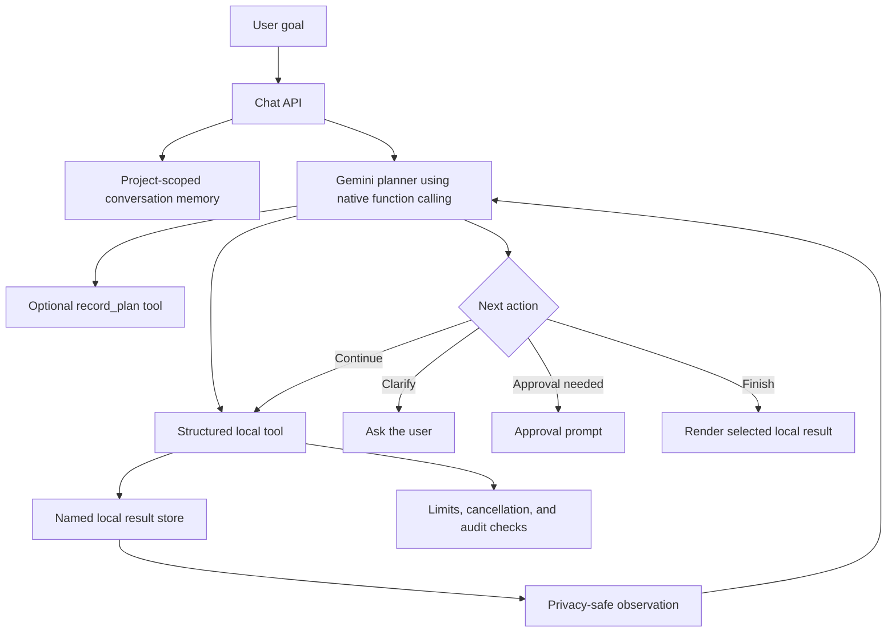

# AIStora Agentic System Guide

This document describes the complete agentic upgrade made to AIStora: what
changed, how the new architecture works, how to configure and operate it, how
privacy is preserved, and how to test or troubleshoot it.

## 1. Current scope

AIStora is a bounded data-analysis agent with a controlled data-preparation
workflow. Analytics is read-only. Auto-cleaning can create a new derived table
after explicit approval, but never overwrites the source.

Within that role, it can:

- Interpret an analytical goal.
- Create a short plan.
- Choose structured tools dynamically.
- Run several dependent analysis steps.
- Save and reuse named intermediate results.
- Inspect privacy-safe observations.
- Recover from invalid tool choices.
- Ask the user for a necessary clarification.
- Request approval for external chart generation.
- Derive suggested questions from column names and inferred types.
- Autonomously choose and execute a useful schema-driven analysis.
- Decide which result answers the goal.
- Verify selected results with deterministic checks and repair failed selections.
- Route simple and complex tasks to separately configured Gemini models.
- Learn from privacy-safe successful plans and explicit user feedback.
- Stop when the task is complete.

It is intentionally not an unrestricted general-purpose agent. It cannot run
arbitrary code, overwrite uploaded data, browse the internet, send messages, or
perform actions outside its allowlisted analytics and cleaning workflows.

## 2. What was replaced

### Previous architecture

```text
User question
    ↓
Gemini generates a Python expression
    ↓
AIStora evaluates the expression
    ↓
One result is returned
```

The previous design had several limitations:

- Only one model-selected operation could run.
- Intermediate results could not be reused.
- Failures ended the request.
- The model generated executable Python.
- There was no plan, memory, clarification, approval, cancellation, or trace.

### Current architecture



Gemini now selects typed functions. AIStora owns the implementation of those
functions, so the model cannot submit Python for execution.

## 3. Main components

| Component | File | Responsibility |
|---|---|---|
| Agent loop | `services/agent_service.py` | Runs the planner/executor loop and processes native function calls. |
| Tool runtime | `services/agent_tools.py` | Implements all structured tools, named results, and limits. |
| Schema agent | `services/schema_agent.py` | Profiles column roles, builds suggestions, and creates autonomous exploration goals. |
| Cleaning agent | `services/data_cleaning_agent.py` | Profiles CSV quality and creates approved cleaned copies. |
| Schema refresh | `services/schema_service.py` | Rebuilds project schema metadata after derived tables are created. |
| Gemini wrapper | `services/llm_service.py` | Configures `google-genai` and manual native function calling. |
| Conversation memory | `services/agent_memory.py` | Stores bounded, project-scoped conversation summaries. |
| Run history | `services/agent_history.py` | Persists privacy-limited evaluations, feedback, metrics, and reusable successful strategies. |
| Result verifier | `services/agent_verifier.py` | Applies deterministic result, tool, bound, and requested-operation checks. |
| Evaluation framework | `services/agent_evaluation.py` | Scores repeatable cases against expected tools, result kinds, and efficiency limits. |
| Model router | `services/model_router.py` | Classifies tasks for standard or advanced Gemini models. |
| Cancellation | `services/agent_control.py` | Handles in-process and cross-worker cancellation signals. |
| Audit trail | `services/agent_audit.py` | Writes privacy-redacted JSONL tool events. |
| Chat API | `routes/chat.py` | Connects authentication, sessions, tools, outcomes, and frontend responses. |
| Agent UI | `templates/components/app/chat_screen.html` | Adds agent state, activity, cancel, and memory controls. |
| Frontend behavior | `static/js/scripts.js` | Renders results, verification, routing, feedback, metrics, traces, approvals, clarification, and cancellation. |
| Configuration | `config.py` | Defines environment-controlled agent budgets. |

## 4. Request lifecycle

### Step 1: Validate the request

`POST /api/chat` verifies:

- The user is authenticated.
- A non-empty question was supplied.
- An active project and schema exist.
- The request ID is a valid UUID.
- Gemini is configured.

### Step 2: Build the agent context

The model receives:

- The current goal.
- Table names.
- Column names and inferred types.
- Row-count metadata when available.
- Detected table relationships.
- Up to eight recent conversation summaries.
- Definitions for the structured tools.

Raw table rows are not included.

### Autonomous schema exploration

The **Auto analyze** mode does not require the user to formulate a query.
`services/schema_agent.py` classifies available columns as:

- Numeric measures.
- Categorical dimensions.
- Temporal fields.
- Identifier-like fields.

Identifier-like columns such as `id`, `*_id`, ZIP, and postal-code columns are
excluded from numeric measure suggestions.

The schema agent builds candidate questions such as table counts, numeric
rankings, grouped totals or averages, categorical breakdowns, and relationship-
based joins. Gemini receives these profiles and candidates, chooses one useful
analysis, records a plan, executes it with structured tools, and returns a
concrete result. It is instructed not to stop after merely listing suggestions.

### Step 3: Plan

For multi-step work, the model is instructed to call `record_plan` alongside
the first executable tool whenever possible. This preserves the visible plan
without using a separate Gemini request only to record it.

Example:

```json
{
  "steps": [
    "Filter to paid transactions",
    "Aggregate paid amount by region",
    "Return the grouped result"
  ]
}
```

The plan is shown in the activity panel and returned by the API.

### Step 4: Execute local tools

Gemini chooses a native function and arguments. AIStora validates the source,
columns, operator, result name, and resource budget before executing it.

### Step 5: Store named results

Analytical tools use a `save_as` argument:

```text
filter_rows(sales → paid_sales)
aggregate_rows(paid_sales → paid_by_region)
finish(paid_by_region)
```

Named results exist only for the current request. They are not placed in the
browser session or sent to Gemini.

### Step 6: Return a privacy-safe observation

The model receives structural metadata instead of result values.

Example table observation:

```json
{
  "status": "ok",
  "name": "top_sales",
  "kind": "table",
  "columns": ["order_id", "amount"],
  "rows": 5
}
```

Example scalar observation:

```json
{
  "status": "ok",
  "name": "sales_count",
  "kind": "number"
}
```

The scalar value itself remains local.

### Step 7: Continue, pause, or finish

The agent can:

- Call another tool.
- Repair an invalid tool call after receiving an abbreviated error.
- Ask a clarification question.
- Pause for chart approval.
- Call `finish` with a named result.
- Return conversational text when no data operation is required.

### Step 8: Deterministically verify and repair

When the agent selects a final result, AIStora checks the result locally. The
checks cover successful tool execution, explicit final-result selection,
named-result availability, output bounds, defined columns, finite scalar
values, and requested aggregate operations such as average or sum.

If a required check fails and the turn budget has room, the verifier returns a
short error observation to the same agent. The agent can then repair the
analysis and select a new result. Verification never asks a second model to
grade the first model.

### Step 9: Record evaluation and learn from success

Each run stores privacy-limited metadata in the application database:

- A goal signature with quoted values and numbers redacted.
- Model and routing tier.
- Plan and privacy-safe tool trace.
- Result kind and name.
- Turn, tool-call, and duration measurements.
- Deterministic verification report.
- Optional user helpful/not-helpful feedback.

For a later request in the same project, AIStora retrieves up to three similar,
verified successful strategies. The model receives their plan, tool sequence,
and result kind, but never receives prior result rows or scalar values.

## 5. Structured tool reference

### `record_plan`

Records up to six short plan steps.

Arguments:

| Name | Type | Required |
|---|---|---|
| `steps` | Array of strings | Yes |

### `inspect_schema`

Returns table columns, types, relationships, and named-result metadata.

Arguments:

| Name | Type | Required |
|---|---|---|
| `table` | String | No |

### `count_rows`

Counts a table or named row-based result.

Arguments:

| Name | Type | Required |
|---|---|---|
| `source` | String | Yes |
| `save_as` | String | Yes |

### `filter_rows`

Filters a table or intermediate DataFrame and saves a reusable DataFrame.

Arguments:

| Name | Type | Required |
|---|---|---|
| `source` | String | Yes |
| `column` | String | Yes |
| `operator` | String | Yes |
| `value` | String | Except for null operators |
| `save_as` | String | Yes |

Allowed operators:

- `eq`
- `neq`
- `gt`
- `gte`
- `lt`
- `lte`
- `contains`
- `starts_with`
- `ends_with`
- `is_null`
- `not_null`

Text matching is case-insensitive. Numeric-looking values are compared
numerically.

### `select_columns`

Projects selected columns and returns a bounded table.

Arguments:

| Name | Type | Required |
|---|---|---|
| `source` | String | Yes |
| `columns` | Array of strings | Yes |
| `limit` | Integer from 1 to 25 | No |
| `save_as` | String | Yes |

### `join_sources`

Inner-joins two row-based sources.

Arguments:

| Name | Type | Required |
|---|---|---|
| `left` | String | Yes |
| `right` | String | Yes |
| `left_column` | String | Yes |
| `right_column` | String | Yes |
| `save_as` | String | Yes |

If both sources contain the same non-key column, the right-side column is
renamed using the right source name as a prefix.

### `aggregate_rows`

Performs streaming grouped aggregation without storing full groups.

Arguments:

| Name | Type | Required |
|---|---|---|
| `source` | String | Yes |
| `group_by` | String | Yes |
| `value_column` | String | Yes |
| `operation` | `count`, `sum`, `avg`, `min`, or `max` | Yes |
| `save_as` | String | Yes |

### `top_rows`

Finds the highest or lowest rows by a numeric column using a bounded heap.

Arguments:

| Name | Type | Required |
|---|---|---|
| `source` | String | Yes |
| `sort_column` | String | Yes |
| `limit` | Integer from 1 to 25 | Yes |
| `descending` | Boolean | Yes |
| `save_as` | String | Yes |

### `create_chart`

Creates a QuickChart URL from a named aggregate result.

Arguments:

| Name | Type | Required |
|---|---|---|
| `source` | Aggregate result name | Yes |
| `title` | String | Yes |
| `chart_type` | `bar`, `line`, or `pie` | Yes |
| `save_as` | String | Yes |

This tool pauses unless `external_chart` approval is present.

### `ask_clarification`

Pauses and asks one necessary question.

Arguments:

| Name | Type | Required |
|---|---|---|
| `question` | String | Yes |

The original goal and the user's next answer are combined when the agent
resumes.

### `finish`

Selects the result that should be rendered.

Arguments:

| Name | Type | Required |
|---|---|---|
| `source` | Named result | No |
| `message` | String | Yes |

Omitting `source` produces a text-only completion.

## 6. Result types

The local result store supports:

| Kind | Contents | Model visibility |
|---|---|---|
| `dataframe` | Reusable row-based intermediate data | Name, columns, row count |
| `table` | Bounded row output | Name, columns, row count |
| `aggregate` | Group keys and calculated metrics | Name, group count, metric name |
| `number` | Count or scalar value | Name and kind only |
| `chart` | QuickChart URL | Name and kind only |

The API converts the selected result into `table`, `count`, `chart`, or `text`
for the frontend.

## 7. Conversation memory

AIStora retains the last eight short conversation summaries per selected
database.

Memory contains:

- A shortened user question.
- A shortened assistant completion summary.
- Result kind and result name when an analysis completed.

Memory does not contain:

- Returned rows.
- Scalar values.
- Full aggregate values.
- Tool-internal intermediate results.

The current implementation stores these summaries in Flask's signed session.
Use **Clear memory** in the chat header or call:

```http
DELETE /api/chat/memory
```

### Evaluation history versus conversation memory

Conversation memory helps follow the current discussion. Evaluation history
supports regression measurement and successful-strategy retrieval across
requests. The two stores are separate and can be deleted independently.

Use **Clear learning** in the chat header or call:

```http
DELETE /api/chat/history
```

## 8. Privacy and security model

### Removed generated code

The previous `secure_eval` path and `services/security.py` were removed. The
model cannot submit executable Python.

### Server-owned operations

The model supplies only structured arguments. AIStora implements every
operation using fixed Python functions.

### Validation

The runtime validates:

- Source names.
- Column existence.
- Result names.
- Operators.
- Chart types.
- Aggregate functions.
- Row and group limits.
- Request UUIDs.

Named result identifiers must start with a letter and contain only letters,
numbers, and underscores.

### Frontend escaping

User text, column names, cell values, messages, plans, and trace summaries are
HTML-escaped before rendering.

### Chart exception

QuickChart is an external service. Creating a chart sends aggregate labels and
values to QuickChart. AIStora therefore pauses for explicit approval. Raw source
rows are not sent by the chart tool.

## 9. Resource budgets

Defaults:

| Setting | Default | Purpose |
|---|---:|---|
| `AGENT_MAX_TURNS` | 8 | Maximum Gemini planner turns |
| `AGENT_MAX_TOOL_CALLS` | 12 | Maximum local tool calls |
| `AGENT_MAX_OUTPUT_ROWS` | 25 | Maximum rows returned to the UI |
| `AGENT_MAX_MATERIALIZED_ROWS` | 25,000 | Maximum filtered or joined rows kept in memory |
| `AGENT_MAX_GROUPS` | 500 | Maximum aggregate groups |
| `AGENT_TIMEOUT_SECONDS` | 45 | Local agent runtime budget |
| `AGENT_MODEL_ROUTING` | true | Enables standard/advanced model selection |
| `AGENT_LLM_MAX_RETRIES` | 2 | Retries transient 500/503/network failures |
| `AGENT_LLM_RETRY_BASE_SECONDS` | 0.5 | Initial exponential-backoff delay |
| `AGENT_HISTORY_EXAMPLES` | 3 | Maximum successful strategies retrieved |
| `CLEANING_MAX_ROWS` | 250,000 | Maximum rows profiled or cleaned in one request |

Configure these in `.env`, using `.env.example` as the template.

The client can request a smaller turn limit through `max_turns`, but cannot
exceed the server-configured maximum.

## 10. Cancellation

The frontend creates a UUID for each request and shows a **Cancel** button while
the agent runs.

Cancellation flow:

```text
Cancel button
    ↓
POST /api/chat/cancel
    ↓
In-memory event + shared marker file
    ↓
Local tools check every 1,000 rows
    ↓
Agent stops with a cancelled response
```

Marker files allow a cancellation request handled by one Gunicorn worker to be
observed by a task running in another worker.

Cancellation is cooperative. An already-running Gemini network request cannot
be interrupted mid-request, but cancellation is checked before the next tool
step and throughout long local row operations.

## 11. Audit logging

Every attempted tool call writes one JSON object to:

```text
instance/agent_audit.jsonl
```

Recorded fields:

```json
{
  "timestamp": "UTC timestamp",
  "request_id": "request UUID",
  "user_id": 123,
  "tool": "filter_rows",
  "arguments": {
    "source": "sales",
    "column": "status",
    "save_as": "paid_sales"
  },
  "status": "ok",
  "duration_ms": 4
}
```

The audit allowlist excludes:

- Filter comparison values.
- Row values.
- Aggregate output values.
- User messages.
- Model prompts.

Approved cleaning operations are logged as `auto_clean` events with source and
destination table names, status, duration, user ID, and approval token.

## 12. API guide

### Run an agent task

```http
POST /api/chat
Content-Type: application/json
```

Example request:

```json
{
  "query": "Show the five highest paid orders",
  "request_id": "81eb04b0-86c5-4984-bc5c-52dc6e58f7d8",
  "approvals": [],
  "max_turns": 6,
  "auto_analyze": false
}
```

Set `auto_analyze` to `true` to activate autonomous schema exploration. The
server then constructs the detailed goal from current columns and relationships.

Example table response:

```json
{
  "type": "table",
  "data": [
    {"order_id": 10, "amount": 500}
  ],
  "message": "Here are the five highest paid orders.",
  "result_name": "top_orders",
  "plan": [
    "Find the highest orders",
    "Return the top five"
  ],
  "trace": [
    {
      "tool": "top_rows",
      "status": "ok",
      "summary": "Created top_orders (5).",
      "duration_ms": 3
    }
  ],
  "budget": {
    "turns_used": 3,
    "tool_calls_used": 3
  },
  "request_id": "81eb04b0-86c5-4984-bc5c-52dc6e58f7d8"
}
```

Possible response types:

- `table`
- `count`
- `chart`
- `text`
- `clarification`
- `approval`
- `cancelled`
- `quota`
- `error`

Completed responses can also include:

- `agent.model`, `agent.routing_tier`, and `agent.routing_reason`.
- `agent.examples_used`.
- `verification.passed`, `verification.score`, checks, and warnings.

### Cancel a task

```http
POST /api/chat/cancel
Content-Type: application/json
```

```json
{
  "request_id": "81eb04b0-86c5-4984-bc5c-52dc6e58f7d8"
}
```

### Clear memory

```http
DELETE /api/chat/memory
```

### Get column-based suggestions

```http
GET /api/chat/suggestions
```

Example response:

```json
{
  "success": true,
  "suggestions": [
    {
      "label": "amount by region",
      "question": "Calculate the total amount in sales, grouped by region.",
      "reason": "Categorical and numeric columns"
    }
  ]
}
```

This endpoint is deterministic and does not call Gemini or scan table rows.

### Save helpful/not-helpful feedback

```http
POST /api/chat/feedback
Content-Type: application/json
```

```json
{
  "request_id": "81eb04b0-86c5-4984-bc5c-52dc6e58f7d8",
  "rating": "up"
}
```

Ratings are restricted to `up` and `down`, and users can only rate their own
agent runs.

### Get project agent metrics

```http
GET /api/chat/metrics
```

Metrics include completion rate, verification rate, positive-feedback rate,
average turns, average tool calls, average duration, model usage, and top
tools.

### Delete learned run history

```http
DELETE /api/chat/history
```

This deletes evaluation records and successful examples for the selected
project. It does not delete uploaded tables or conversation memory.

### Detect relationships

```http
POST /api/detect-relationships
```

The relationship endpoint sees schema metadata, not table rows.

## 13. Frontend behavior

The chat interface now includes:

- **Structured tools • local execution** status.
- Agent activity panel on wide displays.
- Per-response expandable activity trace.
- Plan steps.
- Tool names, statuses, summaries, and durations.
- Turn and tool-call usage.
- Cancel button during active work.
- Clear memory button.
- Auto analyze button.
- Clickable questions derived from current columns.
- Clarification presentation.
- One-time chart approval and denial controls.
- Per-table **Auto clean** buttons.
- Standard/advanced model-routing details.
- Deterministic verification status and warnings.
- Helpful/not-helpful controls on completed answers.
- Project-level run, completion, and feedback metrics.
- Clear-learning control for evaluation history.
- Cleaning previews, quality counts, and explicit copy approval.

The old “Show code” section was removed because the model no longer generates
code.

## 14. Installation

### Native Windows environment

The isolated environment is:

```text
.venv-win
```

Create it if necessary:

```powershell
C:\path\to\python.exe -m venv .venv-win
.\.venv-win\Scripts\python.exe -m pip install -r requirements.txt
```

Copy the environment template:

```powershell
Copy-Item .env.example .env
```

Set at minimum:

```dotenv
GEMINI_API_KEY=your-key
GEMINI_MODEL=gemini-3.6-flash
GEMINI_ADVANCED_MODEL=gemini-3.6-flash
SECRET_KEY=a-long-random-secret
```

Start AIStora:

```powershell
.\.venv-win\Scripts\python.exe app.py
```

Open <http://localhost:5000>.

### Docker

```bash
cp .env.example .env
docker compose up --build
```

Open <http://localhost:5001>.

`docker-compose.yml` now reads `SECRET_KEY` from the environment instead of
containing a hard-coded production secret.

### AWS production deployment

AIStora includes an optional AWS production path with:

- private S3-backed dataset storage;
- private RDS PostgreSQL;
- ECS/Fargate behind an Application Load Balancer;
- ECR, CloudWatch, and Secrets Manager;
- Terraform-managed networking and infrastructure;
- separate least-privilege ECS task and execution roles; and
- GitHub Actions deployment through OIDC rather than stored AWS access keys.

The local analytics engine materializes an S3 object only into bounded
ephemeral storage while it is being analyzed. S3 remains the durable source of
truth, and cleaned outputs are new S3 objects.

See [`AWS_DEPLOYMENT_GUIDE.md`](./AWS_DEPLOYMENT_GUIDE.md) before provisioning
anything. It includes the cost warning, bootstrap sequence, IAM explanation,
CI/CD variables, verification checklist, and honest development limitations.

## 15. Example tasks

### Single-step count

```text
How many orders are in the orders table?
```

Typical tools:

```text
count_rows → finish
```

### Filter and summarize

```text
Calculate paid sales by region.
```

Typical tools:

```text
record_plan
filter_rows(sales → paid_sales)
aggregate_rows(paid_sales → paid_by_region)
finish(paid_by_region)
```

### Join and rank

```text
Join customers with orders and show the ten highest orders.
```

Typical tools:

```text
record_plan
join_sources(customers + orders → customer_orders)
top_rows(customer_orders → top_customer_orders)
finish(top_customer_orders)
```

### Approval-gated chart

```text
Create a bar chart of total sales by country.
```

Typical flow:

```text
aggregate_rows → create_chart → approval prompt
user approves → task reruns → create_chart → finish
```

### Autonomous column-based analysis

Click **Auto analyze** without entering a question.

Typical flow:

```text
profile schema columns
generate candidate analyses
record_plan
execute selected structured tools
finish with a concrete named result
```

## 16. Testing

Run the full suite:

```powershell
.\.venv-win\Scripts\python.exe -m pytest -q
```

Current verified result:

```text
47 passed
```

The suite covers:

- CSV parser behavior.
- Custom DataFrame behavior.
- Named intermediate results.
- Filtering and aggregation.
- Privacy-safe observations.
- Chart approval.
- Resource limits.
- Audit redaction.
- In-process cancellation.
- Cross-worker cancellation.
- Conversation memory.
- Planner/executor flow.
- Clarification.
- Native Gemini tool configuration.
- Transient Gemini retry behavior without retrying exhausted quota.
- Standard/advanced task routing.
- Deterministic result verification and repair.
- Reusable evaluation cases and suite scoring.
- Persistent privacy-limited run history.
- Feedback, successful-strategy retrieval, and project metrics.
- Chat API authentication and responses.
- Named result rendering.
- Agent UI controls.
- Column-role profiling.
- Schema-derived suggestions.
- Autonomous schema-exploration instructions.
- Suggestions API behavior.
- Friendly Gemini quota detection and API responses.
- Cleaning issue detection and cleaned-copy output.
- Preview-token approval enforcement.
- Preservation of original source tables.
- Quoted CSV fields containing commas.

Additional checks completed:

- Python compilation.
- Dependency integrity.
- Frontend JavaScript syntax.
- Flask application startup.
- HTTP 200 for `/` and `/app`.
- Registration of all 27 routes.
- Terraform formatting and validation with the locked AWS provider.
- Validation of all 11 tool declarations with `google-genai`.

Live Gemini connectivity and access to `gemini-3.6-flash` were verified with
the configured API key. Continued agent execution still depends on the active
quota for the Google AI project.

Environment-dependent check not completed:

- Docker runtime validation requires Docker/WSL or the GitHub-hosted build
  runner.

## 17. Troubleshooting

### “AI model not configured”

Set `GEMINI_API_KEY` in `.env`, then restart the application.

### Model returns `404 NOT_FOUND`

Use a model currently available to your Gemini account. The default is
`gemini-3.6-flash` and can be changed without editing code:

```dotenv
GEMINI_MODEL=gemini-3.6-flash
```

Restart AIStora after changing `.env`.

### Gemini returns `429 RESOURCE_EXHAUSTED`

This means the API key and model connected successfully, but the Google AI
project has no quota available for the next request. Agent tasks can make more
than one Gemini request, so a plan may appear before a later request reaches
the limit.

Open Google AI Studio and select the same project that owns the API key. Check
its Usage, Rate limits, and Billing. Either wait for the relevant minute or
daily limit to reset, or enable/increase billing for that project. AIStora now
returns a clear **Gemini quota reached** message and keeps any completed plan
and activity trace instead of displaying the raw SDK error.

### Agent reaches its turn budget

Make the question more specific or raise `AGENT_MAX_TURNS` carefully. Increasing
the budget increases latency and model usage.

### The wrong model tier is selected

Set `AGENT_MODEL_ROUTING=false` to use `GEMINI_MODEL` for every request. When
routing is enabled, simple requests use `GEMINI_MODEL`; autonomous,
cross-table, comparative, and explicitly multi-step requests can use
`GEMINI_ADVANCED_MODEL`.

### A result shows a verification warning

Expand **Agent activity** to see the failed deterministic check. AIStora
already gives the agent a bounded repair opportunity. If the warning remains,
make the requested operation or target columns more explicit and submit
helpful/not-helpful feedback.

### Tool-call budget exceeded

Increase `AGENT_MAX_TOOL_CALLS` or simplify the requested analysis.

### Filter or join exceeds the materialization limit

Ask for a narrower filter, aggregate earlier, or carefully increase
`AGENT_MAX_MATERIALIZED_ROWS`.

### Too many aggregate groups

Choose a broader grouping column or increase `AGENT_MAX_GROUPS`.

### Chart waits for approval

This is intentional. Approve once to share aggregate chart values with
QuickChart, or decline and request a local table instead.

### Cancellation appears delayed

The application cannot interrupt a model network request mid-flight.
Cancellation takes effect before the next agent action or during local row
processing.

### Memory is no longer useful

Use **Clear memory**. Memory is scoped to the selected database.

## 18. Complete file inventory

### Added

- `.env.example`
- `AGENT_GUIDE.md`
- `AGENTIC_CHANGES.md`
- `services/agent_audit.py`
- `services/agent_control.py`
- `services/agent_memory.py`
- `services/agent_history.py`
- `services/agent_verifier.py`
- `services/agent_evaluation.py`
- `services/model_router.py`
- `services/agent_service.py`
- `services/agent_tools.py`
- `services/schema_agent.py`
- `services/data_cleaning_agent.py`
- `services/schema_service.py`
- `tests/test_agent_control.py`
- `tests/test_agent_memory.py`
- `tests/test_agent_history.py`
- `tests/test_agent_quality.py`
- `tests/test_agent_service.py`
- `tests/test_agent_tools.py`
- `tests/test_agent_ui.py`
- `tests/test_chat_routes.py`
- `tests/test_llm_service.py`
- `tests/test_schema_agent.py`
- `tests/test_data_cleaning_agent.py`
- `tests/test_cleaning_routes.py`

### Modified

- `.gitignore`
- `Readme.md`
- `config.py`
- `docker-compose.yml`
- `engine/parser.py`
- `models.py`
- `requirements.txt`
- `routes/chat.py`
- `routes/data.py`
- `routes/tables.py`
- `services/llm_service.py`
- `services/logger.py`
- `static/js/scripts.js`
- `templates/components/app/chat_screen.html`
- `templates/components/app/upload_screen.html`

### Removed

- `services/security.py`

## 19. Auto-cleaning agent

### Purpose

The cleaning agent performs conservative, explainable CSV cleanup locally. It
does not call Gemini and does not send profiling results outside AIStora.

### Automatically detected issues

- Leading and trailing cell whitespace.
- `NA`, `N/A`, `null`, and `none` markers.
- Exact duplicate rows after normalization.
- Fully empty rows.
- Rows with too many or too few cells.
- Blank, duplicated, spaced, or punctuated column headers.
- Missing-value counts by column.

Missing values are reported but never guessed or automatically filled.

### Safety model

```text
User clicks Auto clean
    ↓
Local CSV quality scan
    ↓
Preview with issue counts and proposed actions
    ↓
User explicitly approves
    ↓
Source fingerprint is rechecked
    ↓
Cleaned CSV is written through a temporary file
    ↓
New <table>_cleaned table is registered
```

The original file and table remain unchanged. If the source changes after the
preview, approval is rejected and a new preview is required.

### Cleaning actions

| Action | Behavior |
|---|---|
| `normalize_headers` | Trims headers, replaces unsafe separators, fills blank names, and resolves duplicates. |
| `trim_whitespace` | Removes leading and trailing cell whitespace. |
| `standardize_nulls` | Converts common textual null markers to empty CSV values. |
| `remove_duplicates` | Removes exact duplicates after normalization. |
| `remove_empty_rows` | Removes rows containing no values. |
| `repair_row_width` | Pads missing cells and discards extra trailing cells. |

### Preview endpoint

```http
POST /api/tables/{table_id}/clean/preview
```

The response includes issue counts, missing counts, recommended actions, an
estimated output row count, and a short-lived approval token.

### Apply endpoint

```http
POST /api/tables/{table_id}/clean/apply
Content-Type: application/json
```

```json
{
  "approved": true,
  "approval_token": "preview UUID"
}
```

The response includes the cleaned table name, actions applied, input and output
row counts, and the refreshed project schema.

### CSV compatibility improvement

The streaming CSV parser now uses Python's standards-compliant `csv` reader.
Quoted fields containing commas are handled correctly during inference,
analysis, and cleaning.

## 20. Upgrade summary

The system moved from a one-shot natural-language-to-Python translator to a
bounded analytics agent with:

- Native structured function calling.
- Multi-step planning.
- Named-result chaining.
- Local data execution.
- Privacy-safe observations.
- Error recovery.
- Conversation memory.
- Clarification and approval.
- Visible activity traces.
- Cancellation.
- Resource controls.
- Audit logging.
- Comprehensive automated tests.
- Autonomous query selection based on available columns.
- Approval-gated automatic data cleaning into a preserved derived copy.
- Deterministic verification with bounded self-repair.
- Cost-aware standard/advanced model routing.
- Transient API retries with exponential backoff.
- Persistent privacy-limited evaluations and user feedback.
- Retrieval of similar verified successful tool strategies.
- Per-project quality, cost-proxy, latency, and usage metrics.
