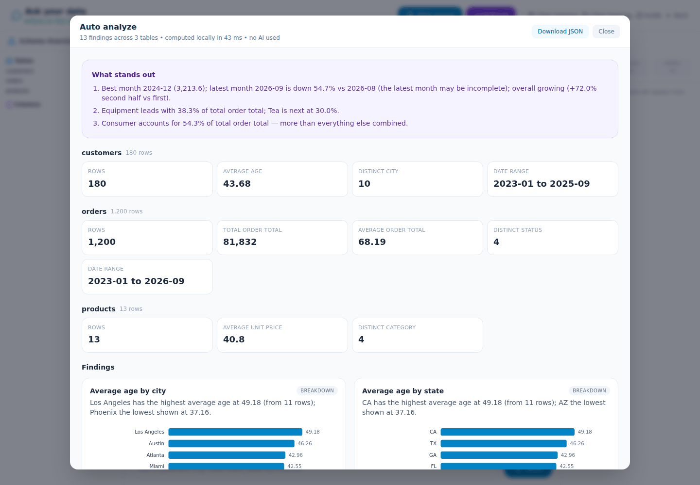
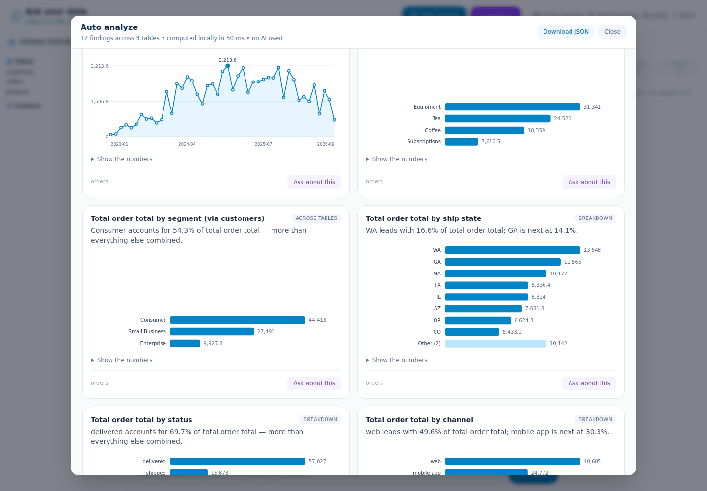

# AIStora

A CSV analysis workspace for sales, operations, research, and everyday data questions. Upload related files, inspect data quality, and ask questions in plain English. Analysis runs on the application server; the AI planner receives your question and permitted schema metadata.

---

## Try it

**Live at [ai-stora.com](https://ai-stora.com)** — free public beta. Create an
account, click **Try the sample dataset** (a small coffee-shop business:
customers, orders, products) and you are looking at a dashboard in under a
minute. The [getting-started guide](https://ai-stora.com/guide) covers what
works, the limits, and how to ask good questions.

<p>
  
</p>
<p>
  
</p>

Questions or want it for your team: **[jamiejwei@gmail.com](mailto:jamiejwei@gmail.com)**.

---

## The problem

CSV files are easy to collect and harder to understand together. AIStora brings
files into a workspace, profiles their quality, and helps answer questions
without requiring SQL. Start with small datasets and inspect results before
using them to make decisions.

## What you get

- **Upload** comma, semicolon, tab or pipe separated CSVs (UTF-8, Excel or
  Latin-1); malformed rows are reported, not silently dropped.
- **Auto clean** previews and, only after approval, writes a cleaned copy:
  tidy headers, trimmed cells, `N/A` → empty, `$1,234.50` / `12%` → numbers,
  `Yes/No` → `true/false`, duplicates removed. The original is never touched.
- **Auto analyze** — a deterministic dashboard of what stands out: totals by
  category with shares, month-by-month trend, top entities and concentration,
  distributions, missing-value flags, and cross-table breakdowns (revenue by
  customer segment through `orders.customer_id → customers`). No AI involved;
  every card links to a follow-up question.
- **EDA report** — column-by-column profile: missingness, duplicates, numeric
  distributions with outlier flags, category breakdowns, time coverage and
  correlations, all computed locally.
- **Ask questions** in plain English. The AI plans safe, structured steps
  (filter, group, join, rank, bucket by month); AIStora executes them on the
  server and shows the result with the steps it took.

## How it is hosted

The public beta runs the [budget profile](docs/deployment/BUDGET_LAUNCH.md):
one small AWS Lightsail server with Caddy (automatic HTTPS), the Flask app,
PostgreSQL and Redis in Docker Compose, Resend for password-reset email, and a
Gemini key behind a hard monthly spend cap. Per-account limits (file size,
tables, databases, AI questions per day) keep it inside a ~$20/month budget;
they are shown on the guide page. The full Terraform/ECS/Fargate stack and the
serverless data platform remain in the repo for larger deployments.

## What makes it different from ChatGPT

Your data is stored on your own server. When you ask a question, the LLM only sees the schema — column names and types — never your actual rows. The query plan is generated from the schema alone and executed locally by our in-memory engine. We also built prompt guardrails to keep query generation predictable and safe against adversarial inputs.

---

## Under the hood

- Custom DataFrame engine — no Pandas, built from scratch; ~250K rows/second
  including CSV parse ([benchmarks](./benchmarks/README.md))
- Streaming CSV parser with delimiter and encoding detection: counts, minimums,
  maximums and top-K run in constant memory; filters and joins bound their
  materialised output
- PostgreSQL for persistence and auth, Redis for server-side session state,
  engine handles compute
- Gemini plans and selects native structured tools
- Named intermediate results support multi-step analysis
- Auto analyze ranks columns by name and type and builds a chart dashboard in one
  streaming pass per table — no model call, nothing leaves the server
- Suggested questions are ranked by column semantics (measures vs dimensions),
  and a `bucket_dates` tool turns "per month" questions into real time series
- One-click deterministic EDA reports profile quality, distributions, time coverage, correlations, privacy, and limits locally
- Approval-gated Auto clean creates a new normalized table without overwriting
  source data; it parses currency/percent/thousands text to numbers and
  standardizes booleans
- Local execution with limits, cancellation, audit logs, and approval gates
- Deterministic result verification can return failed results to the agent for repair
- Cost-aware model routing sends simple work to a standard model and complex work to an advanced model
- Privacy-safe run evaluation, user feedback, and successful-plan retrieval improve later requests
- Per-project success, verification, feedback, latency, and tool-usage metrics
- **Data platform** (September 2026): every upload runs through a six-stage
  pipeline — validate, profile, quality gate, typed Parquet, Apache Iceberg
  merge, register — with per-dataset schema contracts, replace / append /
  merge loads, snapshot rollback, optional type-2 history, scheduled Postgres
  and Google Sheets connectors, nightly dbt marts and a pipeline-health view.
  Serverless on AWS (S3 → EventBridge → Step Functions → Lambda/DuckDB → Glue
  catalog) for about $1–2/month idle; in-process locally with no AWS at all.

See [ARCHITECTURE.md](./docs/ARCHITECTURE.md) for the component map, request
lifecycle, the two privacy boundaries, where state lives, and the invariants
the system depends on.

See [PROJECT_GUIDE.md](./docs/project/PROJECT_GUIDE.md) for the long-form
guide: design rationale, technology choices, threat model, testing strategy
and honest limitations.

See [CHANGELOG.md](./docs/CHANGELOG.md) for the September 2026 review
remediation — what was wrong, why it mattered, and what replaced it.

See [AGENT_GUIDE.md](./docs/agent/AGENT_GUIDE.md) for the tool and API
reference, configuration, operating guide, troubleshooting and file
inventory.

See [APPLIED_AI_UPGRADE.md](./docs/agent/APPLIED_AI_UPGRADE.md) for the routed,
schema-constrained planning flow, privacy policies, evaluation metrics, tracing,
and current limitations.

See [EDA_REPORT.md](./docs/analysis/EDA_REPORT.md) for the report contents,
privacy behavior, limits, testing steps, and honest statistical limitations.

See [DATA_PLATFORM.md](./docs/DATA_PLATFORM.md) for the pipeline: the lake
layout, the stages, load modes and rollback, schema contracts, the quality
gate, orchestration, telemetry marts, connectors, cost, and the decisions
behind each piece.

See [AWS_DEPLOYMENT_GUIDE.md](./docs/deployment/AWS_DEPLOYMENT_GUIDE.md) for the S3-backed
dataset layer, private RDS PostgreSQL, ECS/Fargate deployment, Terraform,
GitHub OIDC CI/CD, and least-privilege IAM design.

All project guides are indexed in [docs/README.md](./docs/README.md).

---

## Tech stack

| Layer | Tools |
|---|---|
| Backend | Flask, SQLAlchemy, Alembic, Gunicorn |
| Engine | Custom DataFrame + streaming CSV parser + Parquet source |
| Data platform | DuckDB, Apache Iceberg (PyIceberg), Parquet, dbt, Step Functions, Lambda, EventBridge, Glue Data Catalog |
| Database | PostgreSQL |
| Sessions | Redis (filesystem fallback for local development) |
| AI / LLM | Google Gemini |
| Frontend | Vanilla JS, Tailwind CSS |
| Infra | AWS S3, RDS, ElastiCache, ECS/Fargate, ECR, Lambda, Step Functions, EventBridge, Glue, IAM, Terraform, Docker, GitHub Actions |

---

## Development

### Run it locally

```bash
git clone https://github.com/JamieWei213213/AiStora.git
cd AIStora
cp .env.example .env   # add your Gemini API key
docker compose up --build
# open http://localhost:5001
```

Compose starts the application, PostgreSQL and Redis. Database migrations run
automatically on container start. The data pipeline runs in-process against a
local lake volume; nothing in AWS is needed. Load a file from the command line
with `python -m pipeline.local_runner data.csv --project 1 --dataset invoices`.

### Without Docker

```bash
python -m venv .venv && source .venv/bin/activate
pip install -r requirements-dev.txt
cp .env.example .env          # add your Gemini API key
flask --app app db upgrade    # apply migrations
flask --app app run --port 5000
```

Without `REDIS_URL` the session store falls back to the local filesystem,
which is fine for a single process.

### Tests

```bash
pip install -r requirements-dev.txt
pytest -q                                    # 280+ tests, including tests/pipeline
pytest --cov=. --cov-report=term
```

The suite runs with no external services and no network access.

### Frontend

Tailwind is compiled to `static/css/tailwind.css` and committed; the icon
library is vendored. Node is only needed when you change templates or scripts
— see [docs/FRONTEND_BUILD.md](./docs/FRONTEND_BUILD.md).

---

MIT License · Started as a DSCI 551 project (USC, Fall 2025), now a live public beta
