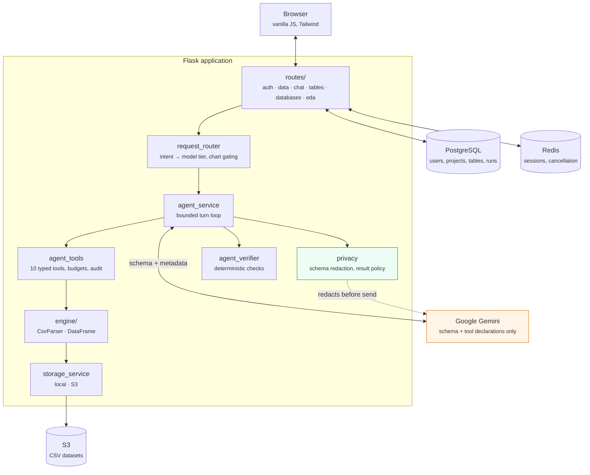

# AIStora Architecture

How the system is put together, what each part is responsible for, and which
properties must stay true as it changes.

- [The one thing that matters](#the-one-thing-that-matters)
- [Component map](#component-map)
- [Request lifecycle](#request-lifecycle)
- [The privacy boundary](#the-privacy-boundary)
- [State: what lives where](#state-what-lives-where)
- [Data model](#data-model)
- [The query engine](#the-query-engine)
- [Bounds and failure behaviour](#bounds-and-failure-behaviour)
- [Deployment topology](#deployment-topology)
- [Invariants](#invariants)

---

## The one thing that matters

An accountant cannot paste a client's ledger into a chat assistant. AIStora
exists to answer questions about that ledger without the ledger ever reaching a
language model.

The mechanism is a split of responsibilities:

- **The model plans.** It sees table names, column names, column types and
  privacy classifications. From those it chooses a sequence of typed tool calls.
- **The server executes.** Tool calls run locally against the CSV. The model
  receives back only structural metadata — how many rows, which columns, how
  many groups — never values.
- **The browser renders.** The result rows travel from the server to the data
  owner's browser directly, on a path the model is not part of.

Everything else in this document is in service of that split.

---

## Component map



The boxes worth knowing:

| Module | Responsibility |
|---|---|
| `routes/` | HTTP surface, authentication, authorization, rate limiting |
| `services/request_router.py` | Classifies intent for model-tier selection; gates the external chart tool |
| `services/agent_service.py` | The turn loop: send, receive tool calls, execute, feed results back |
| `services/agent_tools.py` | The ten tools the model may call, their budgets, and the audit trail |
| `services/privacy.py` | The redaction applied before anything reaches a prompt |
| `services/agent_verifier.py` | Deterministic post-hoc checks that can send a result back for repair |
| `services/agent_history.py` | Privacy-safe run records, plan retrieval, per-project metrics |
| `engine/` | The CSV parser and DataFrame — all data access goes through here |
| `services/storage_service.py` | Dataset persistence, local filesystem or S3 |
| `services/session_store.py` | Server-side session storage |

---

## Request lifecycle

A question travels through the system like this.

**1. Authorize.** `routes/chat.py` requires a session, resolves the active
project, and applies a per-user sliding-window rate limit.

**2. Load schema.** `services/schema_service.active_schema()` reads the
project's tables from Postgres. The schema is not cached in the session; the
database is the single source of truth.

**3. Route.** `request_router.route_request()` classifies the question to pick
a model tier — the cheap model for simple work, the capable model for
comparisons, joins, charts and anything it cannot classify. It also decides
whether `create_chart` is offered, since that tool sends data to a third party.

Classification is advisory. Every request gets the full analytical tool set.
This is deliberate and was not always true: the router used to withhold tools
when no keyword matched, which meant that ordinary questions arrived at the
agent with nothing to answer them with.

**4. Redact.** `privacy.redact_schema()` builds the only schema representation
allowed into a prompt. Columns classified as credentials are dropped entirely.
Every other column is annotated with its classification so the model can reason
about sensitivity without seeing values.

**5. Plan and execute.** `agent_service.run_agent()` opens a Gemini chat with
the tool declarations and loops:

```
model turn ──► tool calls ──► runtime.execute() ──► privacy metadata ──► model turn
   ▲                                                                         │
   └─────────────────────── until finish, clarification, ────────────────────┘
                            approval, or a budget is hit
```

Each tool call is checked against the budget, executed against the local
engine, recorded in the trace and written to the append-only audit log. The
response handed back to the model is built by `_privacy_metadata()` — a name, a
kind, a row or group count, a column list. Never a value.

**6. Verify.** When the model calls `finish`, `verify_outcome()` runs
deterministic checks: was a named result actually selected, does the aggregate
operation match what the question asked for, is a scalar result finite, is the
output within bounds. A failed check is returned to the model as a tool error
so it can repair the analysis, once per turn until the turn budget is spent.

No model is asked to grade another model's output. The checks are ordinary
code.

**7. Render.** `_format_finished()` reads the rows out of the named result and
applies the *result* policy — a separate boundary from the schema policy — then
returns JSON. The browser escapes every value on the way into the DOM.

**8. Record.** `finish_run()` stores a privacy-safe record: a goal *signature*
rather than the goal, the plan, the tool trace, token counts, latency and the
verification outcome.

---

## The privacy boundary

There are two boundaries and conflating them is the easiest mistake to make in
this codebase.

### Boundary 1 — what may enter a prompt

Governed by `AGENT_SCHEMA_PRIVACY`, default `classified`. **This is the
product's core guarantee. Do not relax it.**

What crosses: table names, column names, column types, row counts, column
classifications, previously detected relationships, the user's own question,
and privacy-safe summaries of successful past runs.

What never crosses: any cell value from any dataset, at any point, on any path.
Tool responses carry metadata only. Error messages are truncated and reference
columns by name, not by content.

`classify_column()` labels each column as `credential`, `direct_identifier`,
`identifier`, `financial`, `unstructured_text` or `ordinary`. Credentials are
removed from the schema before it is serialized. The `aliases` mode goes
further and replaces every table and column name with a salted hash, for
deployments where even a column name is sensitive.

### Boundary 2 — what the data owner sees

Governed by `AGENT_RESULT_PRIVACY`, default `full`.

This controls the rows rendered in the browser of the person who uploaded the
file. It defaults to showing them, because masking an accountant's own client
names in their own session protects data from the person it belongs to.
`masked` remains available for shared screens and demos, and `aggregate_only`
for deployments that should never render rows at all.

Changing this setting has no effect whatsoever on Boundary 1.

### The one deliberate exception

`create_chart` builds a QuickChart URL containing aggregate labels and values,
which leaves the server. It is gated three ways: the router only offers the
tool when a chart was asked for, the runtime pauses for explicit user approval
before calling it, and the approval prompt states plainly what will be sent.

---

## State: what lives where

| State | Home | Why |
|---|---|---|
| User identity (`user_id`) | Signed session cookie | Small, and it is the session |
| Active project id | Signed session cookie | One integer |
| Project schema | **PostgreSQL** | Single source of truth; changes when tables change |
| Agent memory, pending approvals, cleaning previews | **Redis** (filesystem fallback) | Too large for a cookie; must survive across processes |
| Detected relationships | **Redis** | Model-derived, per-session, not worth persisting |
| Datasets | **S3** (local filesystem in development) | Containers are ephemeral |
| Run history and metrics | **PostgreSQL** | Durable, queryable, per-project |
| In-flight cancellation | **Redis** (on-disk marker fallback) | The cancel request lands on a different process than the run |
| Audit log | Append-only JSONL | Deliberately excludes row and filter *values* |

Session payloads are server-side because they did not fit in a cookie.
Browsers cap a cookie at roughly 4093 bytes; six tables of twenty-five columns
plus a full agent memory measured 6.6 KB, and the application's own configured
ceiling of twenty tables by sixty columns measured 11.4 KB. Over the limit the
browser discards the cookie silently and the user is logged out mid-session
with no error raised anywhere. `tests/test_session_size.py` holds that line.

---

## Data model

```
User ──1:N──► Project ──1:N──► Table
  │              │
  └──1:N──► AgentRun ◄──N:1────┘
```

- **User** — email and password hash. Nothing else.
- **Project** — a "database" in the interface: a named group of uploaded CSVs.
- **Table** — one uploaded CSV: display name, original filename, storage
  reference, inferred column types, row count.
- **AgentRun** — one attempt at one question. Holds a goal *signature*, the
  plan, the tool trace, model and routing tier, token counts, duration,
  verification result and optional user feedback.

`goal_signature()` is worth understanding. It reduces a question to intent
words and schema terms using an **allow-list**: a token survives only if it is
a known analytical word or appears in the project's own schema. Everything
else — names, amounts, quoted strings, emails, URLs — is replaced with
`[value]` or `[number]`. A blocklist would leak whatever it failed to
anticipate; an allow-list fails closed.

Schema changes are applied by Alembic (`flask db upgrade`, run from
`entrypoint.sh`). `db.create_all()` remains available for local development
and tests but is disabled in production, because it can create a missing table
and can never alter an existing one.

---

## The query engine

`engine/` is a CSV parser and a DataFrame written from scratch, with no Pandas.

**`CsvParser`** streams rows and infers column types from a sample (1000 rows by
default). Values matching known null markers — `n/a`, `-`, `null`, `(blank)`
and similar — are treated as missing rather than as evidence that a column is
text. A value that cannot be cast to the column's type becomes `None`, so a
column holds exactly one Python type.

**`DataFrame`** wraps either a file or a list of dicts. Being precise about
what streams:

- Constant memory: `count`, `max_by`, `min_by`, `top_k_by` (bounded heap).
- Materializes its output: `filter`, `project`, `join`.

The agent bounds materializing operations with `AGENT_MAX_MATERIALIZED_ROWS`,
`AGENT_MAX_GROUPS` and `AGENT_MAX_OUTPUT_ROWS`, and aborts with a clear error
rather than exhausting memory.

Within one agent run, a base table is loaded once and cached. Previously each
tool call re-queried Postgres, re-materialized the object from storage and
reopened the file — a three-step analysis paid that cost three times. One run
sees one immutable snapshot, so caching is safe.

**Measured performance.** On 200,000 rows (17 MB), including parse time:
roughly 220–280K rows/second, with a worst-case p95 of 0.93 s across grouped
aggregation, filter + top-K, and streamed max. Parsing dominates, not
aggregation. See [`benchmarks/`](../benchmarks/README.md) to reproduce.

**Comparison semantics.** `filter_rows` resolves a comparison strategy once,
before scanning, from the operator and the supplied value:

- Value parses as a number → numeric comparison; non-numeric rows do not match.
- Value parses as an unambiguous date → chronological comparison. `03/04/2026`
  is rejected as ambiguous; `2026-03-04` and `25/12/2026` are not.
- Neither, with an ordering operator → an explicit tool error the model can see
  and correct.
- Neither, with equality or a text operator → case-insensitive text comparison.

The previous implementation fell back to comparing `str(actual)` against
`str(expected)`, so `"9" > "10"` was true and a filter could return
confidently wrong rows with no error anywhere.

---

## Bounds and failure behaviour

Every loop in the agent path is bounded.

| Bound | Default | Enforced in |
|---|---|---|
| Model turns | 8 | `agent_service` |
| Tool calls | 12 | `AgentToolRuntime._check_budget` |
| Self-corrections | 3 | `record_correction` |
| Wall clock | 45 s | `_check_running`, polled every 1000 rows |
| Materialized rows | 25 000 | `filter_rows`, `join_sources` |
| Aggregate groups | 500 | `aggregate_rows` |
| Rendered rows | 25 | `select_columns`, `top_rows`, render path |
| Question length | 4000 chars | `routes/chat.py` |
| Agent requests | 20/min/user | `SlidingWindowRateLimiter` |
| Login attempts | 10/min per address and per account | `routes/auth.py` |

Failure modes and what the user sees:

- **Model quota exhausted** → a specific, actionable message naming the cause,
  not a generic error.
- **Transient model error** → retried with exponential backoff, capped.
- **Invalid tool call** → the error is returned to the model as a tool result
  so it can self-correct; counted against the correction budget.
- **Budget exceeded** → HTTP 429 with the partial plan and trace, so the user
  can see how far it got.
- **Cancellation** → HTTP 409; the run stops at its next row checkpoint.
- **Internal exception** → a generic message to the user, full detail to the
  server log. Exception text is never returned to the browser.

---

## Deployment topology

```
Internet
   │
   ▼
Application Load Balancer  ── public subnets
   │                          (HTTPS when certificate_arn is set;
   │                           HTTP otherwise — see the gap below)
   ▼
ECS Fargate task           ── private application subnets
   │                          gunicorn, 2 workers × 2 threads
   ├──────────► RDS PostgreSQL  ── isolated subnets, no internet route
   ├──────────► ElastiCache Redis ── private, TLS, disabled by default
   ├──────────► S3 via VPC endpoint (datasets never traverse the internet)
   └──────────► Gemini API via NAT, egress on 443 only
```

Deployment runs through GitHub Actions using OIDC — no long-lived AWS keys.
Images are built, pushed to ECR, and rolled out with health checks; a failing
task never replaces a healthy one.

**Known gap:** the ALB serves plain HTTP until `certificate_arn` is set, which
is why `SESSION_COOKIE_SECURE` must currently be disabled in that environment.
The Terraform already supports the HTTPS listener and the redirect; it needs a
certificate for a domain. Until then, session cookies travel in cleartext.
The application logs a warning at startup when it detects this combination.

---

## Invariants

Things that must remain true. If a change breaks one of these, the change is
wrong.

1. **No cell value from any dataset ever reaches a language model.** Not in a
   prompt, not in a tool response, not in an error message, not in a run
   record. `tests/test_applied_ai_upgrade.py` and the tool metadata tests guard
   this.
2. **The agent cannot execute arbitrary code.** It selects from a fixed set of
   typed tools with validated arguments. There is no `eval`, no generated SQL,
   no generated Python.
3. **Every loop is bounded** by turns, tool calls, rows, groups and wall clock.
4. **Every dataset access is scoped to the caller's project.** Table loading
   goes through `get_dataframe`, which filters on the session's active project;
   route handlers verify project ownership independently.
5. **Source data is never overwritten.** Cleaning writes a new table and
   verifies the source fingerprint is unchanged before it starts.
6. **Anything rendered into the DOM is escaped.** Column names come from
   uploaded CSVs, which are untrusted files.
7. **The agent always has tools to answer with.** Routing may choose a cheaper
   model; it may not leave the agent unable to read data.
