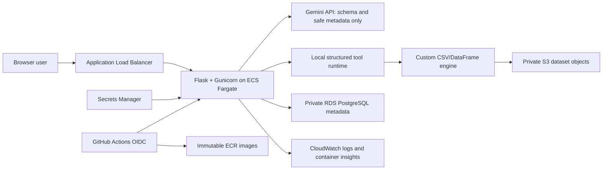

# AIStora Complete Technical and Interview Guide

This is the source-of-truth guide for explaining AIStora in interviews. It
covers what the system does, how the agent works, why each technology was
chosen, the AWS design, security decisions, testing, tradeoffs, limitations,
and strong answers to likely follow-up questions.

## 1. Start with the honest project status

As of August 2, 2026:

- The bounded agent, structured tools, schema-driven analysis, data cleaning,
  pluggable S3 storage layer, RDS configuration, Docker image, Terraform stack,
  IAM policies, and GitHub Actions pipeline are implemented.
- The application has 47 automated tests and 27 Flask routes. The local health
  endpoint returns HTTP 200.
- GitHub Actions has successfully run the Python tests, Terraform validation,
  Docker build, container boot, and container health check.
- The AWS Terraform stack has **not** been applied yet. No ECS service, RDS
  instance, or S3 dataset bucket is live yet, and no AWS deployment claim
  should be made on a resume until that deployment is completed and tested.
- A root AWS CLI session was detected during setup and immediately logged out.
  Provisioning is intentionally paused until a non-root bootstrap identity with
  MFA and short-lived credentials is available.

Use this distinction in interviews:

> The application and AWS infrastructure are implemented and CI-tested. The
> live AWS rollout is pending a non-root bootstrap identity; I deliberately
> refused to provision from root credentials.

That answer is stronger than pretending the deployment is live. It shows that
security controls changed an engineering decision.

## 2. The shortest useful explanation

### One sentence

AIStora is a privacy-first, bounded analytics agent that converts natural-
language questions into allowlisted local data operations while keeping raw
CSV rows out of the language model.

### 30-second version

> I built AIStora for people who need to analyze CSV exports without sending
> sensitive rows to an LLM. Gemini receives the schema and chooses typed tools
> such as filter, aggregate, join, and top-K. The Flask service validates and
> executes those operations locally with a custom streaming CSV engine, sends
> only structural observations back to the model, and deterministically checks
> the final result. I also added schema-driven auto-analysis, approval-gated
> data cleaning, S3-backed dataset storage, RDS PostgreSQL configuration, and an
> ECS/Fargate deployment design with Terraform and GitHub OIDC.

### Two-minute version

> The original system was closer to text-to-code: the model generated a Python
> expression and the server evaluated it. I replaced that with a bounded agent
> loop and native function calling. The model can plan, call structured tools,
> create named intermediate results, inspect privacy-safe observations, repair
> invalid calls, ask a clarification, request approval for an external chart,
> and explicitly finish with a selected result. The model never receives raw
> rows or scalar result values.
>
> The data path is separated from metadata. CSV objects can be stored in a
> private, encrypted S3 bucket, while users, projects, table metadata, schemas,
> and privacy-limited run history live in PostgreSQL on private RDS. Fargate
> tasks run in private application subnets behind a public ALB. RDS is in
> isolated database subnets and accepts port 5432 only from the ECS security
> group. Runtime S3 access comes from an ECS task role, secret injection comes
> from a separate execution role, and GitHub Actions deploys with short-lived
> OIDC credentials restricted to the main branch and this ECS service.
>
> The current honest status is that the complete stack is implemented and the
> Python, Terraform, and production container paths pass CI. The billable AWS
> resources are not live yet because I stopped when the CLI identity resolved
> to root; I am completing the bootstrap through a non-root identity first.

## 3. What makes it agentic

AIStora is agentic within a deliberately narrow domain. It is not an
unrestricted autonomous system.

| Agent capability | How AIStora implements it |
|---|---|
| Goal interpretation | Gemini receives the user goal plus table and column metadata. |
| Planning | `record_plan` stores up to six visible steps. |
| Tool selection | Gemini native function calling selects from server-defined tools. |
| Multi-step work | Named results from one tool can be inputs to later tools. |
| Observation | The model sees result name, kind, columns, and size, not values. |
| Error recovery | Invalid tool calls return abbreviated errors for another turn. |
| Clarification | `ask_clarification` pauses and resumes with the user's answer. |
| Approval | External chart generation pauses until the user approves it. |
| Verification | Deterministic local checks reject invalid final selections. |
| Repair | A failed verification can be sent back to the same agent for correction. |
| Memory | Eight bounded, project-scoped conversation summaries are retained. |
| Experience reuse | Similar verified successful plans can be retrieved for later requests. |
| Model routing | Simple and complex goals can use different Gemini models. |
| Control | Turn, tool, row, group, time, and output budgets bound execution. |
| Stop condition | `finish` explicitly selects the result to render. |

The best answer to “Is it fully agentic?” is:

> It is a bounded agent, not a general-purpose autonomous agent. Within the
> analytics domain it can plan, choose and chain tools, observe outcomes,
> repair errors, use memory, request clarification or approval, and decide when
> to finish. It cannot execute arbitrary code or act outside its allowlist.

## 4. End-to-end architecture



### Upload path

1. An authenticated user selects a project and uploads a CSV.
2. Flask validates ownership, filename, extension, and upload size.
3. The server parses the temporary file to infer headers, types, and row count.
4. The storage abstraction writes the file to local storage in development or
   S3 in cloud mode.
5. PostgreSQL stores the table name, durable storage URI, inferred schema, row
   count, project, and user relationship.
6. If the database transaction fails, AIStora attempts to delete the newly
   written object so metadata and storage do not silently diverge.

### Question path

1. `POST /api/chat` validates authentication, active project, schema, question,
   request UUID, and model availability.
2. The model router selects the standard or advanced model tier.
3. AIStora builds context from the goal, schema, detected relationships,
   bounded conversation summaries, and similar verified successful plans.
4. Gemini chooses one or more typed functions.
5. The server validates every function argument and executes the operation
   locally against the custom DataFrame engine.
6. The model receives only a privacy-safe observation, such as the result name,
   columns, type, and row count.
7. The loop continues until clarification, approval, cancellation, a budget
   limit, an error, or `finish`.
8. A deterministic verifier checks the selected result and can give the agent a
   repair turn.
9. Flask renders the local result, records privacy-limited run metadata, and
   accepts optional helpful/not-helpful feedback.

### Auto-analyze path

The schema agent classifies columns as measures, dimensions, temporal fields,
or identifier-like fields. It excludes likely identifiers such as `id`,
`*_id`, ZIP, and postal-code fields from numeric-measure suggestions. It then
builds candidate analyses—counts, rankings, grouped totals or averages, and
relationship-based joins—and asks the bounded agent to choose and execute one.

### Auto-clean path

Auto-cleaning is deterministic and local; it is not an LLM rewriting data.

1. AIStora materializes the source and profiles headers, whitespace, null
   tokens, duplicate rows, empty rows, and malformed row widths.
2. It returns a preview, action list, dataset fingerprint, and approval token.
3. The user explicitly approves selected actions.
4. AIStora checks the fingerprint again to prevent cleaning a changed source.
5. It writes a new CSV, uploads it through the selected storage backend, and
   creates a new table record.
6. The original file and original table are never overwritten.

## 5. The agent tool catalog

These are model-facing tools. Gemini chooses the function and arguments; Python
owns all implementation.

| Tool | Purpose | Important control |
|---|---|---|
| `record_plan` | Records the intended analysis steps. | Maximum six short steps. |
| `inspect_schema` | Reads table columns, types, relationships, and named-result metadata. | No raw rows. |
| `count_rows` | Counts a source. | Scalar value stays local. |
| `filter_rows` | Applies an allowlisted comparison and saves a row result. | Column/operator validation and materialization limit. |
| `select_columns` | Projects columns into a bounded output table. | At most 25 output rows by default. |
| `join_sources` | Performs an inner join between row-based sources. | Validated keys and 25,000-row materialization limit. |
| `aggregate_rows` | Performs count, sum, average, min, or max by group. | Streaming state and 500-group default. |
| `top_rows` | Selects highest or lowest numeric rows. | Bounded heap and 25-row default. |
| `create_chart` | Builds a QuickChart URL from an aggregate. | Requires explicit external-data approval. |
| `ask_clarification` | Pauses for one necessary user answer. | Question is length-bounded. |
| `finish` | Selects the named result shown to the user. | Required for explicit result selection. |

Why this is safer than generated code:

- The model cannot import libraries, open files, use the network, or execute
  Python.
- Source names, column names, operators, aggregations, chart types, result
  names, and limits are validated by server code.
- A bad model decision becomes a rejected function call, not arbitrary process
  execution.
- Tool results remain request-local and cannot overwrite source tables.

## 6. Memory, “learning,” routing, and verification

### Conversation memory

AIStora keeps up to eight short summaries per project in the signed Flask
session. It stores a shortened question, completion summary, result type, and
result name. It does not store result rows or scalar values in this memory.

### Successful-plan retrieval

The `AgentRun` table stores privacy-limited run metadata. A normalized goal
signature removes quoted values and numbers while retaining analytical intent
and schema terms. For a later similar question in the same project, AIStora can
retrieve up to three verified successful examples containing the plan, tool
sequence, and result kind.

This is **not reinforcement learning**. It is retrieval of prior successful
strategies. There is no reward-model training, policy-gradient update, or model
weight change.

### Model routing

The router uses explainable heuristics. Auto-analysis, joins, comparisons,
trends, relationships, multi-step language, or long task descriptions select
the advanced tier; simple requests select the standard tier. Routing can be
disabled with configuration.

### Verification

Verification is deterministic rather than “LLM-as-judge.” Checks include:

- no local tool ended in error;
- `finish` was called;
- the selected named result exists;
- output rows stay within the configured bound;
- selected columns are defined;
- scalar numbers are finite; and
- a requested operation such as sum or average was actually performed.

The verifier is intentionally limited. It can validate structural correctness
and some stated intent, but it cannot prove that every semantically plausible
answer is the best business answer.

## 7. Custom data engine

AIStora does not rely on Pandas for its query runtime. The custom engine has:

- a streaming CSV parser with sampled type inference;
- generators for repeated file scans;
- filter and projection operations;
- streamed row counting;
- streamed grouped aggregation that stores group state rather than full groups;
- bounded top-K ranking;
- hash-based inner joins; and
- file-backed or in-memory DataFrame results.

### Why build it

The project demonstrates understanding of parsing, iterators, type inference,
aggregation state, joins, bounded memory, and query execution rather than only
calling a dataframe library.

### Honest limitations

- It is an educational analytics engine, not a replacement for Pandas, DuckDB,
  Spark, or a warehouse.
- Some operations still materialize rows and are bounded at 25,000 rows.
- The join builds an in-memory index of the right side.
- CSV type inference samples only a limited number of rows.
- It has no query optimizer, vectorized execution, spill-to-disk strategy,
  distributed execution, or columnar format.
- For larger production data, a good evolution would be Parquet plus DuckDB,
  Athena, or Spark depending on volume and concurrency.

## 8. Storage and database design

### Why S3 and RDS have different jobs

S3 stores durable dataset objects. RDS stores transactional metadata and
relationships.

| Data | Location | Reason |
|---|---|---|
| CSV bytes | S3 | Durable object storage, versioning, scale, and low-cost capacity. |
| Users/password hashes | PostgreSQL | Transactions, uniqueness, and relational queries. |
| Projects and table catalog | PostgreSQL | Ownership and referential integrity. |
| Column schemas and row counts | PostgreSQL JSON/columns | Fast UI and agent context without scanning each file. |
| Agent-run metadata and feedback | PostgreSQL | Queryable evaluation history. |
| Temporary downloaded object | Fargate `/tmp` | Ephemeral execution cache, not durable state. |

S3 object keys use this shape:

```text
datasets/<project_id>/<random_uuid>/<safe_filename>.csv
```

The database stores an `s3://bucket/key` reference. On analysis, the storage
service checks S3 metadata, derives a cache key from bucket/key/ETag/version/
size, downloads the object to an ephemeral cache if necessary, and passes that
local materialization to the custom engine.

### S3 controls

- all public-access block settings are enabled;
- bucket-owner-enforced object ownership is used;
- versioning is enabled;
- objects use SSE-S3 (`AES256`) encryption;
- the bucket policy denies non-TLS requests;
- object paths are validated against the configured bucket and prefix; and
- the ECS task role can only get, put, and delete `datasets/*` objects.

### RDS controls

- PostgreSQL 16;
- private, isolated database subnets;
- no public endpoint;
- storage encryption;
- RDS-managed master password in Secrets Manager;
- `rds.force_ssl=1` and application `sslmode=require`;
- seven-day automated backup retention;
- gp3 storage with autoscaling from 20 GB to 100 GB; and
- security-group access only from the ECS task security group on port 5432.

## 9. AWS architecture

### Network layout

Two Availability Zones each receive:

- a public subnet for the ALB;
- a private application subnet for Fargate; and
- an isolated database subnet for RDS.

The public route table reaches an internet gateway. Private application
subnets use one NAT gateway for outbound Gemini and AWS API access. Database
subnets have no internet route. An S3 gateway endpoint lets application
subnets reach S3 without sending that traffic through the NAT gateway.

### Request flow

```text
Internet
  -> ALB :80 or :443
  -> ECS security group :5000
  -> Gunicorn/Flask container
  -> RDS security group :5432
  -> S3 through the gateway endpoint
  -> Gemini over outbound TLS through NAT
```

### Why ECS/Fargate

Fargate runs the existing Dockerized web service without managing EC2 hosts.
It fits a long-running Flask application better than forcing the application
into short Lambda invocations, and it provides task roles, private networking,
ALB integration, health checks, rolling deployments, and CloudWatch logging.

### Reliability controls

- ALB target health check at `/health`;
- container-level health check;
- ECS deployment circuit breaker with rollback;
- 100% minimum and 200% maximum healthy deployment percentages;
- CloudWatch log retention for 30 days;
- ECS container insights; and
- RDS backups and automated minor upgrades.

The development defaults are intentionally cost-aware: one Fargate task after
deployment, one NAT gateway, single-AZ RDS, and a `db.t4g.micro` database. Those
choices reduce cost but are not a high-availability production topology.

## 10. IAM: the section interviewers will probe

There are three separate runtime/deployment roles because their jobs differ.

### ECS task role: what application code may do

The task role is available to `boto3` inside the running application. It can:

- `s3:GetObject`;
- `s3:PutObject`; and
- `s3:DeleteObject`;

only under the exact AIStora bucket's `datasets/*` path.

It cannot administer RDS, list all secrets, deploy ECS services, or access
unrelated buckets. No AWS access keys are stored in `.env` or the container.

### ECS execution role: what ECS needs to start the task

The execution role is used by the ECS control plane, not normal application
code. It has the AWS-managed task-execution policy for pulling ECR images and
writing logs, plus `secretsmanager:GetSecretValue` only for:

- the Flask secret;
- the Gemini API key; and
- the RDS-managed password secret.

This separation prevents the application from automatically inheriting all
image-pull and secret-bootstrap permissions.

### GitHub deployment role: what CI/CD may change

GitHub Actions requests a short-lived AWS session through OIDC. The trust policy
requires:

- issuer `token.actions.githubusercontent.com`;
- audience `sts.amazonaws.com`; and
- subject matching this repository's exact `main` branch.

The permission policy can authenticate to ECR, push only to the AIStora ECR
repository, register/read task definitions, update only the exact AIStora ECS
service, and pass only the exact AIStora task and execution roles to ECS.

There are no long-lived AWS keys in GitHub Secrets.

### Bootstrap identity

Terraform still needs a human/operator identity for the initial infrastructure
creation. The intended process is:

1. Use root only to create and secure a non-root administrative bootstrap
   identity, then sign root out.
2. Enable MFA and do not create a long-lived access key.
3. Use `aws login` to obtain short-lived console-backed CLI credentials.
4. Verify `aws sts get-caller-identity` is non-root before planning or applying.
5. Use the GitHub OIDC role for normal application deployments after bootstrap.

Do not claim “root is never used in AWS.” Root is the account owner and may be
needed for initial account tasks. The correct claim is that application,
deployment, and routine provisioning do not run with root credentials.

## 11. Container design

The Docker image:

- uses `python:3.12-slim`;
- installs the project's Python requirements during the image build;
- creates a non-root UID/GID `10001`;
- creates writable application runtime directories;
- runs as the non-root user;
- exposes port 5000;
- includes an HTTP health check; and
- starts Gunicorn through a small entrypoint that ensures database tables exist.

Gunicorn defaults to two workers and two threads per worker, with environment
variables available for tuning. The container writes durable datasets to S3
and treats `/tmp` caches as disposable.

## 12. CI/CD flow

### Pull request

Every pull request to `main` runs three non-deploying jobs:

1. **Python:** install dependencies, run 47 tests, compile Python source, and
   check dependency integrity.
2. **Terraform:** check formatting, initialize without a backend, and validate
   the configuration.
3. **Container:** build the production Docker image, boot it, call `/health`,
   and remove the test container.

The deploy job is skipped for pull requests, so opening a PR cannot create or
change AWS resources.

### Main branch deployment

After the infrastructure exists and GitHub repository variables are set, a push
to `main` performs:

1. all test, Terraform, and container gates;
2. GitHub OIDC authentication to the scoped AWS role;
3. ECR login;
4. Docker build with an immutable commit/run-attempt image tag;
5. ECR push;
6. download and sanitize the current ECS task definition;
7. replace only the container image URI;
8. register and deploy the new task definition;
9. wait for ECS service stability; and
10. smoke-test the public `/health` endpoint.

Terraform provisioning is currently an operator-run step. CI validates
Terraform but does not automatically apply infrastructure changes. A remote S3
backend configuration is provided as an example but is not live yet.

## 13. Tool and technology guide

| Tool | Where it is used | Why it was chosen | Interview phrase |
|---|---|---|---|
| Python 3.12 | Entire backend and engine | Fast development and strong data/AI ecosystem. | “Python owns deterministic execution; the model only chooses typed operations.” |
| Flask | HTTP API, sessions, auth, UI routes | Small, explicit web framework suited to this project. | “Flask coordinates auth, agent state, storage, and rendering.” |
| SQLAlchemy | Users, projects, tables, runs | ORM, transactions, relationships, and DB portability. | “I use database transactions for metadata and compensate storage writes on failure.” |
| PostgreSQL | Cloud relational state | Constraints, JSON metadata, transactions, durable run history. | “RDS stores metadata, not the CSV object bytes.” |
| SQLite | Local fallback | Zero-setup development and tests. | “Configuration switches the same ORM models between local and cloud databases.” |
| Gemini / `google-genai` | Planner and native function calling | Structured model tool calls and chat turns. | “Automatic function execution is disabled; my server executes every call.” |
| Custom DataFrame | Local analytics | Demonstrates execution internals and privacy boundary. | “The LLM plans; the local engine computes.” |
| Streaming `csv` parser | File scans and type inference | Avoids loading every source row for simple scans. | “Several operations are streamed; materializing operations have explicit limits.” |
| boto3 | S3 operations | AWS SDK credential chain automatically consumes the ECS task role. | “No static AWS keys are passed to application code.” |
| S3 | Dataset object storage | Durable, versioned, scalable object storage. | “S3 stores bytes; RDS stores ownership and metadata.” |
| RDS PostgreSQL | Managed database | Backups, encryption, managed password, private networking. | “The DB is not public and only trusts the ECS security group.” |
| Docker | Reproducible application artifact | Same container contract in CI and ECS. | “The image runs as UID 10001 and passes a real boot health check in CI.” |
| Gunicorn | Production WSGI server | Multiple workers/threads and environment tuning. | “Flask's dev server is not used in the container.” |
| ECS/Fargate | Container runtime | No EC2 host management, IAM task roles, ALB integration. | “Fargate matches a long-running web API better than Lambda here.” |
| ECR | Container registry | Private AWS-native registry and ECS integration. | “Tags are immutable, scanned on push, and lifecycle-limited.” |
| ALB | Public entry point | Health checks and HTTP/HTTPS routing to private tasks. | “Only the ALB can reach the ECS application port.” |
| VPC/subnets | Network isolation | Separates public ingress, private compute, and isolated DB. | “RDS has no internet route; ECS has outbound-only access through NAT.” |
| Security groups | Stateful network policy | Service-to-service rules instead of broad CIDRs. | “RDS allows 5432 from the ECS security group, not from the internet.” |
| IAM roles | Runtime and deployment authorization | Short-lived credentials and least privilege. | “Task, execution, and GitHub deploy roles have different trust and permission policies.” |
| Secrets Manager | Runtime secrets | Avoids keys in source, images, task definitions, and Terraform variables. | “ECS injects three exact secrets through the execution role.” |
| CloudWatch | Logs and container insights | Centralized runtime visibility. | “Container stdout/stderr goes to a 30-day log group.” |
| Terraform | Infrastructure as code | Repeatable, reviewable graph of AWS resources. | “The VPC, S3, RDS, ECS, and IAM design validates in CI.” |
| GitHub Actions | Tests and deployments | Review gates and OIDC-based automation. | “PRs cannot deploy; main assumes a branch-bound AWS role.” |
| Pytest | Automated validation | Unit and route-level regression tests. | “The suite covers tools, memory, verification, cleaning, storage, and chat routes.” |
| QuickChart | Optional chart rendering | Simple hosted chart generation. | “It is the one intentional external-data exception and requires approval.” |
| Vanilla JS / Tailwind | Frontend | Lightweight activity, result, approval, and feedback UI. | “The UI exposes plan, trace, verification, cancellation, and model routing.” |

## 14. Security and privacy threat model

### Raw-data privacy boundary

Gemini receives table names, column names, inferred types, relationships,
row-count metadata, privacy-safe tool observations, and abbreviated errors. It
does not receive uploaded rows, returned rows, scalar results, or aggregate
values.

The exception is approved chart generation: aggregate labels and values are
sent to QuickChart after an explicit approval step.

### Prompt injection

A CSV cell cannot directly become an instruction to the LLM because raw cell
values are never included in the prompt. A malicious user question can still
ask for unsupported behavior, but the server exposes only allowlisted function
declarations and validates arguments.

### Other controls

- password hashing through Werkzeug;
- project ownership checks on table and database routes;
- safe CSV filenames and extension checks;
- maximum upload size;
- no model-generated code execution;
- frontend HTML escaping;
- approval before external chart data transfer;
- cooperative cancellation;
- privacy-redacted JSONL audit events;
- S3 encryption/versioning/public-access block/TLS-only policy;
- RDS encryption/TLS/private subnet/security group;
- Secrets Manager rather than committed secrets;
- non-root container user; and
- OIDC rather than long-lived CI credentials.

### Security gaps to acknowledge

- HTTPS requires an ACM certificate; the default development ALB output is HTTP.
- The Flask authentication layer should add CSRF protection, stricter cookie
  policy review, password policy, account recovery, and rate limiting before
  handling real financial data.
- SSE-S3 is used, not a customer-managed KMS key with separate key policy.
- Application audit JSONL is written to ephemeral task storage; central durable
  audit-event storage is a future improvement.
- Dependency versions should be locked and automated vulnerability scanning
  should be extended beyond ECR image scanning.

## 15. Testing strategy

The 47-test suite covers:

- parser and DataFrame behavior;
- structured tool validation and chaining;
- agent planning, finish, clarification, approval, and repair behavior;
- conversation memory and run-history retrieval;
- model routing, retry, and quota handling;
- deterministic verification and evaluation cases;
- schema-driven suggestions and autonomous analysis;
- cleaning preview, approval, fingerprints, and derived-copy behavior;
- local/S3 storage behavior, encryption arguments, caching, and path safety;
- chat, feedback, metrics, cancellation, upload, and cleaning routes; and
- frontend exposure of agent activity and controls.

Useful commands:

```powershell
.\.venv-win\Scripts\python.exe -m pytest -q
.\.venv-win\Scripts\python.exe -m compileall -q app.py config.py models.py engine routes services tests
.\.venv-win\Scripts\python.exe -m pip check
```

Terraform checks:

```powershell
terraform -chdir=infra/terraform fmt -check -recursive
terraform -chdir=infra/terraform init -backend=false
terraform -chdir=infra/terraform validate
```

The most important test is not only “Docker build succeeded.” GitHub Actions
boots the actual production image and waits for `/health` to confirm that the
entrypoint, file permissions, Gunicorn, Flask, and local database startup work
together.

## 16. Common interview questions and strong answers

### “Why is this an agent rather than a chatbot?”

> A chatbot produces text in one pass. AIStora maintains execution state,
> creates a plan, selects and chains tools, observes results, handles errors,
> can pause for clarification or approval, verifies its selected result, and
> decides when to finish. Its autonomy is bounded by server-owned tools and
> budgets.

### “Does the LLM execute SQL or Python?”

> No. Gemini emits typed function calls. The Flask service validates those
> arguments and calls fixed Python implementations. The previous generated-
> Python path was removed.

### “How do you keep customer data away from Gemini?”

> The prompt contains schema and metadata, not rows. Tool responses sent back
> to Gemini contain structure—result name, kind, columns, and size—but hide row,
> scalar, and aggregate values. Computation and rendering remain local.

### “How do you know the answer is correct?”

> I do not claim perfect semantic correctness. I use deterministic checks for
> tool success, explicit final selection, result existence, output bounds,
> defined columns, finite values, and requested aggregate operations. Failed
> checks can trigger an agent repair turn. Deeper business-semantic validation
> is still a future area.

### “How does memory work?”

> Short conversation summaries are project-scoped in the signed session. A
> separate PostgreSQL run-history store keeps redacted goal signatures, plans,
> tool traces, verification, latency, and feedback. Similar verified successes
> can be retrieved, but raw results are never used as memory.

### “Is that reinforcement learning?”

> No. It is retrieval-augmented strategy reuse. The system retrieves prior
> verified plans and tool sequences; it does not update Gemini weights or train
> a policy from rewards.

### “Why not send the CSV to Gemini?”

> Financial exports may contain sensitive data, model context is limited, and
> sending rows increases cost and privacy risk. Schema-only planning plus local
> execution gives a much clearer data boundary.

### “Why S3 instead of the container filesystem?”

> Fargate filesystems are ephemeral and tasks can be replaced at any time. S3
> gives durable, versioned object storage shared by any replacement task. Local
> disk is only a cache.

### “Why RDS if the files are already in S3?”

> S3 is not a relational catalog. RDS handles users, ownership, projects, table
> metadata, uniqueness, and agent-run history transactionally. The systems
> solve different storage problems.

### “What happens if S3 succeeds but the DB commit fails?”

> The upload route rolls back the database transaction and attempts a
> compensating S3 delete. It is not a distributed transaction, so production
> hardening could add an outbox/reconciliation job for rare cleanup failures.

### “Why ECS/Fargate rather than EC2?”

> The workload needs a long-running web process but not host customization.
> Fargate removes server patching and capacity management while retaining ALB,
> VPC, task-role, health-check, and rolling-deployment integration.

### “Why not Lambda?”

> The current Flask/Gunicorn service, multipart uploads, agent turns, and local
> materialization fit a container service naturally. Lambda could work after a
> redesign, but its invocation and ephemeral-storage model is less direct here.

### “What is the difference between the ECS task and execution roles?”

> The task role is assumed by application code and only manages dataset objects
> in one S3 prefix. The execution role is used by ECS to pull the image, write
> logs, and fetch the three runtime secrets. Separating them prevents accidental
> privilege inheritance.

### “How does GitHub authenticate to AWS?”

> GitHub's OIDC token is exchanged with AWS STS for a short-lived role session.
> The role trust requires this repository, the `main` branch, and the AWS STS
> audience. No AWS access key is stored in GitHub.

### “Can the GitHub role deploy anything in the account?”

> No. It can push to one ECR repository, update one ECS service, register task
> definitions, and pass only the two AIStora ECS roles. Some ECS registration
> read actions require wildcard resources, but deployment mutation is scoped.

### “What happened with root credentials?”

> During setup I checked `sts get-caller-identity` before applying Terraform.
> It returned the account root ARN, so I immediately ran `aws logout` and
> stopped. The stack remains unapplied until a non-root MFA-protected bootstrap
> identity is used. That check prevented convenience from bypassing the IAM
> design.

### “How is the network isolated?”

> The ALB is in public subnets. Fargate tasks are in private application
> subnets with no public IP. RDS is in isolated database subnets. Security
> groups allow ALB-to-ECS on 5000 and ECS-to-RDS on 5432. S3 uses a gateway
> endpoint; other outbound TLS uses NAT.

### “What does the S3 endpoint save or improve?”

> S3 traffic stays on the AWS network path and avoids NAT data processing for
> those object requests. It also reduces dependence on the NAT gateway for the
> application's main data-storage path.

### “Where are secrets?”

> The RDS password is managed by RDS in Secrets Manager. The Flask secret and
> Gemini key have dedicated Secrets Manager entries. ECS injects them at task
> startup through the execution role; they are not in Git, the Docker image, or
> normal task-definition environment fields.

### “How do deployments fail safely?”

> Tests and a real container boot run before deployment. Images have immutable
> tags. ECS waits for service stability and has a deployment circuit breaker
> with rollback. The workflow then probes `/health` and fails visibly if the
> application or database is unavailable.

### “How would you scale it?”

> ECS can increase task count, but I would first move session state to a shared
> store such as Redis or server-side sessions, move audit events to durable
> centralized storage, and replace file-marker cancellation with Redis or a
> database signal. The S3 and RDS layers already support task replacement, but
> those local coordination mechanisms need to become distributed.

### “What is the biggest current scalability bottleneck?”

> The custom CSV engine repeatedly scans and sometimes materializes row data.
> The 25,000-row intermediate bound intentionally prevents runaway memory, but
> it also limits complex large analyses. A production evolution would convert
> uploads to Parquet and query with DuckDB/Athena or use Spark for much larger
> workloads.

### “How would you make the database highly available?”

> Enable Multi-AZ RDS and deletion protection, retain final snapshots, deploy at
> least two ECS tasks across AZs, add autoscaling, and use one NAT gateway per AZ
> or more VPC endpoints. The current defaults favor a portfolio-development
> budget over high availability.

### “How do you handle schema migrations?”

> Today startup calls `db.create_all`, which is acceptable for the prototype but
> not a full migration strategy. Before production I would add Alembic/Flask-
> Migrate, run forward-only migrations as a separate deployment step, and test
> backward compatibility during rolling releases.

### “What do you monitor?”

> The app records run status, latency, turn count, tool count, verification,
> feedback, and tool usage in PostgreSQL. ECS sends logs and container insights
> to CloudWatch. The next step is CloudWatch alarms for unhealthy targets,
> deployment failures, RDS capacity, error rate, and agent latency.

### “What would you change before real financial data?”

> I would require HTTPS with a custom domain, strengthen authentication and
> CSRF/rate limiting, add migrations, centralized audit retention, KMS keys,
> vulnerability/dependency scanning, backups and restore drills, data retention
> controls, shared session/cancellation state, alarms, and a formal threat model.

### “Did AI help you build it?”

> Yes. I used an AI coding assistant for implementation support, review, and
> documentation, but I validated the behavior with tests, CI, identity checks,
> and source review. I can explain the architecture, security boundaries,
> tradeoffs, and limitations, and I do not claim unverified deployment work.

## 17. Tradeoffs to volunteer in a strong interview

Good candidates explain what they deliberately did **not** optimize.

| Decision | Benefit | Cost / limitation |
|---|---|---|
| Schema-only LLM context | Stronger privacy and lower token use. | The model cannot inspect ambiguous values or data distributions. |
| Structured tools | Predictable, testable, safer than code generation. | Less flexible than arbitrary SQL/Python. |
| Custom CSV engine | Demonstrates fundamentals and keeps execution local. | Lower performance and feature depth than mature engines. |
| S3 + local materialization | Durable shared storage with simple engine integration. | Download latency and repeated scans. |
| One NAT gateway | Lower development cost. | AZ dependency and not fully highly available. |
| Single-AZ RDS default | Lower cost. | Database outage during some failures/maintenance. |
| Signed-session conversation memory | Simple and shared across tasks if the same secret is used. | Cookie size and privacy constraints; not ideal for rich memory. |
| File-marker cancellation | Works across Gunicorn workers in one task. | Does not reliably coordinate across multiple ECS tasks. |
| Deterministic verifier | Fast, explainable, and no second-model cost. | Cannot prove full semantic correctness. |
| Operator-run Terraform apply | Human review before costs and destructive changes. | Infrastructure changes are not fully automated. |

## 18. Failure scenarios you should be able to explain

### Gemini quota exhaustion

Quota errors are detected separately from transient service errors and returned
with an actionable billing/quota message. They are not retried repeatedly
because retries would waste time and quota.

### Temporary Gemini outage

Network and 500/502/503/504-style failures use bounded exponential backoff with
two retries by default.

### Invalid model tool call

The runtime returns an abbreviated validation error. If turn budget remains,
the model can select corrected arguments or another tool.

### Runaway analysis

Turn, tool, time, output-row, materialized-row, and aggregate-group limits stop
the run. Local loops check cancellation every 1,000 rows.

### Changed dataset during cleaning

The apply route compares the current storage fingerprint with the approved
preview fingerprint. A mismatch invalidates the preview.

### ECS deployment failure

Unhealthy targets prevent stability, the deployment circuit breaker can roll
back, and the GitHub job fails. The previous immutable ECR image remains
available.

### RDS unavailable

`/health` executes `SELECT 1` and returns HTTP 503 if the database is not
available, causing container, ALB, and deployment health checks to fail.

## 19. Resume bullets

### Use now, before live AWS deployment

> Engineered an AWS-ready agentic analytics service with schema-only Gemini
> function calling, S3/RDS storage abstractions, Terraform-defined ECS/Fargate
> infrastructure, least-privilege IAM roles, and GitHub OIDC CI; validated 47
> tests and production-container health in GitHub Actions.

### Use only after Terraform apply and a successful live smoke test

> Deployed a containerized agentic analytics service on AWS ECS/Fargate with
> S3-backed dataset storage and private RDS PostgreSQL, provisioned through
> Terraform and least-privilege IAM roles with GitHub OIDC CI/CD.

### Agent-focused bullet

> Replaced model-generated Python with a bounded Gemini function-calling agent
> that plans and chains typed analytics tools, keeps raw rows local, verifies
> results deterministically, and supports clarification, approval, cancellation,
> memory, and feedback.

Never say “trained an RL model,” “built a distributed query engine,” “deployed
highly available production infrastructure,” or “zero data leaves the system.”
Those statements are not supported by the current implementation.

## 20. STAR story

### Situation

The application could answer one analytics request by having a model generate a
Python expression, but that design was difficult to control, inspect, extend,
or defend for sensitive financial exports.

### Task

Convert it into a bounded agent with a clear privacy boundary, multi-step local
analysis, safer data preparation, measurable behavior, and a realistic cloud
deployment design.

### Action

I removed generated-code execution and defined typed tools for schema
inspection, filtering, selection, joins, aggregation, ranking, chart approval,
clarification, and finishing. I added named intermediate results, planning,
budgets, cancellation, deterministic verification, model routing, redacted run
history, feedback, schema-driven auto-analysis, and approval-gated cleaning. I
abstracted dataset persistence behind local and S3 implementations, configured
PostgreSQL for private RDS, containerized the service as a non-root user, and
defined ECS/Fargate, networking, secrets, and IAM in Terraform. GitHub Actions
now tests Python, validates Terraform, and boots the production container before
any main-branch deployment.

### Result

The project now has 47 passing tests, a real container health gate, an explicit
data/privacy boundary, separate least-privilege runtime and CI roles, and a
reviewable AWS deployment path. The live rollout remains intentionally pending
until non-root AWS bootstrap access is configured.

## 21. Five-minute demo script

1. **Problem:** “I want to analyze a sensitive CSV without pasting rows into a
   chatbot.”
2. **Upload:** Upload a sample CSV and point out the inferred schema.
3. **Agent:** Ask a multi-step question such as “Filter delayed flights, group
   by carrier, calculate average air time, and show the top five.”
4. **Trace:** Open Agent Activity and show the plan, structured tool sequence,
   routing tier, named result, and verification.
5. **Privacy:** Explain that Gemini saw schema and structural observations, not
   the displayed values.
6. **Auto analyze:** Let the schema agent choose a useful analysis from column
   roles.
7. **Auto clean:** Preview whitespace/null/duplicate cleanup, approve it, and
   show that a new table was created while the source remains.
8. **Cloud:** Show Terraform/IAM and the green GitHub Actions jobs. Say clearly
   whether the AWS stack is live at that moment.

## 22. Repository map

| Path | What to know |
|---|---|
| `app.py` | Flask factory, database initialization, `/health`, blueprints. |
| `config.py` | Local/cloud database, storage, models, budgets, and limits. |
| `engine/parser.py` | Streaming CSV parser and type inference. |
| `engine/dataframe.py` | Custom dataframe operations. |
| `services/agent_service.py` | Planner/executor turn loop. |
| `services/agent_tools.py` | Tool declarations, execution, validation, budgets. |
| `services/agent_verifier.py` | Deterministic result checks. |
| `services/agent_memory.py` | Bounded conversation summaries. |
| `services/agent_history.py` | Redacted run records, feedback, metrics, retrieval. |
| `services/model_router.py` | Standard/advanced task routing. |
| `services/schema_agent.py` | Column profiling, suggestions, auto-analysis goal. |
| `services/data_cleaning_agent.py` | Deterministic cleaning preview and copy. |
| `services/storage_service.py` | Local/S3 storage, cache, fingerprint, delete. |
| `routes/chat.py` | Agent API, resume states, feedback, metrics, cancellation. |
| `routes/data.py` | Upload, schema inference, durable storage, metadata. |
| `routes/tables.py` | Table management and cleaning approval flow. |
| `models.py` | User, project, table, and agent-run persistence. |
| `Dockerfile` / `entrypoint.sh` | Non-root production container. |
| `infra/terraform/` | VPC, S3, RDS, ECR, ECS, ALB, IAM, secrets, outputs. |
| `.github/workflows/deploy-aws.yml` | Tests, container gate, OIDC deployment. |
| `tests/` | 47 automated tests across agent, data, storage, and routes. |

## 23. Production-readiness backlog

If asked “What next?”, prioritize these rather than proposing more agent buzzwords:

1. Finish the non-root AWS bootstrap, configure remote Terraform state, apply
   the stack, set the Gemini secret, configure GitHub variables, deploy, and run
   a live S3/RDS smoke test.
2. Add ACM HTTPS, a custom domain, secure-cookie review, CSRF protection, rate
   limiting, and stronger account controls.
3. Add Alembic migrations and a deployment migration strategy.
4. Move audit, cancellation, and richer session state to durable/shared stores.
5. Add CloudWatch alarms, dashboards, distributed tracing, and restore drills.
6. Pin dependencies, create an SBOM, and add vulnerability/secret scanning.
7. Add ECS autoscaling, at least two tasks, Multi-AZ RDS, and multi-AZ NAT or
   private service endpoints if the availability requirement justifies cost.
8. Convert large uploads to Parquet and evaluate DuckDB/Athena/Spark based on
   measured workloads.
9. Expand evaluation datasets for ambiguous questions, adversarial prompts,
   numerical edge cases, and schema drift.

## 24. Final interview rules

- Explain the request and data flow before listing products.
- Tie every AWS service to a concrete problem in this application.
- Say “least privilege” only if you can name the exact role and permissions.
- Say “agentic” only with examples of state, tools, observations, decisions,
  repair, and stop conditions.
- Do not call retrieval of successful plans reinforcement learning.
- Volunteer one real limitation and how you would measure or fix it.
- Never claim the AWS deployment is live until you can show the ECS service,
  S3 objects, RDS connection, health endpoint, CI deployment, and CloudWatch
  logs.
- If AI assisted development, say so honestly and demonstrate ownership by
  explaining code paths, tests, failures, and tradeoffs without guessing.

## 25. Official references worth reviewing

- [AWS ECS task IAM roles](https://docs.aws.amazon.com/AmazonECS/latest/developerguide/task-iam-roles.html)
- [AWS ECS task execution role](https://docs.aws.amazon.com/AmazonECS/latest/developerguide/task_execution_IAM_role.html)
- [AWS CLI short-lived console login](https://docs.aws.amazon.com/cli/latest/userguide/cli-configure-sign-in.html)
- [Amazon S3 public-access block](https://docs.aws.amazon.com/AmazonS3/latest/userguide/access-control-block-public-access.html)
- [Amazon RDS password management with Secrets Manager](https://docs.aws.amazon.com/AmazonRDS/latest/UserGuide/rds-secrets-manager.html)
- [GitHub Actions AWS OIDC credential action](https://github.com/aws-actions/configure-aws-credentials)
- [GitHub Actions ECS deployment action](https://github.com/aws-actions/amazon-ecs-deploy-task-definition)
- [Terraform S3 backend](https://developer.hashicorp.com/terraform/language/backend/s3)
