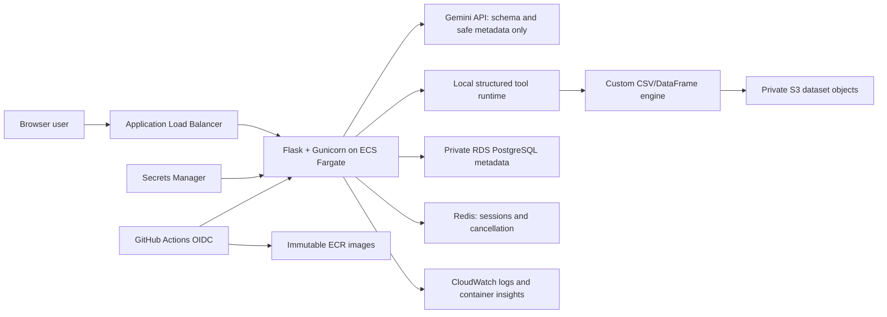

# AIStora Project Guide

This is the source-of-truth technical guide to AIStora. It covers what the
system does, how the agent works, why each technology was chosen, the AWS
design, security and privacy decisions, testing, tradeoffs, and limitations.

The guide is deliberately candid about what is not implemented, what is only
partly implemented, and what would have to change before the system handled
real financial data. Those caveats are part of the documentation, not an
afterthought to it.

## Contents

1. [Project status](#1-project-status)
2. [The shortest useful explanation](#2-the-shortest-useful-explanation)
3. [What makes it agentic](#3-what-makes-it-agentic)
4. [End-to-end architecture](#4-end-to-end-architecture)
5. [The agent tool catalog](#5-the-agent-tool-catalog)
6. [Memory, retrieval, routing, and verification](#6-memory-retrieval-routing-and-verification)
7. [Custom data engine](#7-custom-data-engine)
8. [Storage, database, and session state](#8-storage-database-and-session-state)
9. [AWS architecture](#9-aws-architecture)
10. [IAM](#10-iam)
11. [Container design](#11-container-design)
12. [CI/CD flow](#12-cicd-flow)
13. [Tool and technology guide](#13-tool-and-technology-guide)
14. [Security and privacy threat model](#14-security-and-privacy-threat-model)
15. [Testing strategy](#15-testing-strategy)
16. [Design decisions and rationale](#16-design-decisions-and-rationale)
17. [Tradeoffs](#17-tradeoffs)
18. [Failure scenarios](#18-failure-scenarios)
19. [Demo walkthrough](#19-demo-walkthrough)
20. [Repository map](#20-repository-map)
21. [Production-readiness backlog](#21-production-readiness-backlog)
22. [References](#22-references)

## 1. Project status

As of September 2, 2026:

- The bounded agent, structured tools, schema-driven analysis, deterministic
  data cleaning, deterministic local EDA reporting, pluggable S3 storage layer,
  RDS configuration, Docker image, Terraform stack, IAM policies, and GitHub
  Actions pipeline are implemented.
- The application has 163 automated tests at 84% line coverage, and 26
  blueprint routes plus the `/health` endpoint.
- GitHub Actions runs the Python tests, Terraform validation, Docker build,
  container boot, and container health check on every pull request to `main`.
- The AWS stack was applied and verified on August 3, 2026. The deployed
  artifacts, verification steps, and the exact resources created are recorded
  in `docs/deployment/AWS_DEPLOYMENT_RECORD.md`. That deployment is a
  cost-aware development topology, not a highly available production one:
  single-AZ RDS, one NAT gateway, one ECS task, and a plain-HTTP ALB endpoint.
- Infrastructure provisioning uses a non-root bootstrap identity. Root
  credentials are not used for provisioning, application runtime, or CI.

### Changes made on September 2, 2026

These are recent enough that older documents in this repository may still
describe the previous behavior:

- **Request routing no longer restricts tools.** Every request now receives the
  full analytical tool set (see [section 6](#6-memory-retrieval-routing-and-verification)).
- **Session state is server-side** (Flask-Session, Redis in deployment,
  filesystem cachelib fallback locally). It used to live in the signed
  client-side cookie.
- **The project schema is read from Postgres on demand** through
  `services/schema_service.active_schema()` instead of being copied into the
  session.
- **Alembic owns the database schema.** `entrypoint.sh` runs `flask db upgrade`;
  `db.create_all()` is now a development and test convenience only.
- **`AGENT_RESULT_PRIVACY` now defaults to `full`.** The separate schema
  boundary, `AGENT_SCHEMA_PRIVACY`, is unchanged and still defaults to
  `classified`.
- **Dependencies are pinned**, and test-only packages moved to
  `requirements-dev.txt` so they are no longer installed into the production
  image.
- **`SECRET_KEY` is mandatory in production**; the process refuses to start
  without it.
- **A Content-Security-Policy and HSTS are sent**, and frontend output escaping
  was fixed.
- **Authentication was hardened**: rate limiting, email validation and
  normalization, a minimum password length, and session reset on login.
- **`/api/chat/cancel` verifies run ownership.**

## 2. The shortest useful explanation

### One sentence

AIStora is a privacy-first, bounded analytics agent that converts natural-
language questions into allowlisted local data operations while keeping raw
CSV rows out of the language model.

### Short version

AIStora is for people who need to analyze CSV exports without sending sensitive
rows to an LLM. Gemini receives the schema and chooses typed tools such as
filter, aggregate, join, and top-K. The Flask service validates and executes
those operations locally with a custom streaming CSV engine, sends only
structural observations back to the model, and deterministically checks the
final result. On top of that sit schema-driven auto-analysis, approval-gated
data cleaning, S3-backed dataset storage, RDS PostgreSQL, and an ECS/Fargate
deployment defined in Terraform with GitHub OIDC CI/CD.

### Longer version

The original system was closer to text-to-code: the model generated a Python
expression and the server evaluated it. That was replaced with a bounded agent
loop and native function calling. The model can plan, call structured tools,
create named intermediate results, inspect privacy-safe observations, repair
invalid calls, ask a clarification, request approval for an external chart, and
explicitly finish with a selected result. The model never receives raw rows or
scalar result values.

The data path is separated from metadata. CSV objects are stored in a private,
encrypted S3 bucket, while users, projects, table metadata, schemas, and
privacy-limited run history live in PostgreSQL on private RDS. Fargate tasks
run in private application subnets behind a public ALB. RDS is in isolated
database subnets and accepts port 5432 only from the ECS security group.
Runtime S3 access comes from an ECS task role, secret injection comes from a
separate execution role, and GitHub Actions deploys with short-lived OIDC
credentials restricted to the `main` branch and this ECS service.

## 3. What makes it agentic

AIStora is agentic within a deliberately narrow domain. It is not an
unrestricted autonomous system.

| Agent capability | How AIStora implements it |
|---|---|
| Goal interpretation | Gemini receives the user goal plus table and column metadata. |
| Planning | `record_plan` stores up to six visible steps. |
| Tool selection | Gemini native function calling selects from server-defined tools. |
| Multi-step work | Named results from one tool can be inputs to later tools. |
| Observation | The model sees result name, kind, columns, and size, not values. |
| Error recovery | Invalid tool calls return abbreviated errors for another turn. |
| Clarification | `ask_clarification` pauses and resumes with the user's answer. |
| Approval | External chart generation pauses until the user approves it. |
| Verification | Deterministic local checks reject invalid final selections. |
| Repair | A failed verification can be sent back to the same agent for correction. |
| Memory | Eight bounded, project-scoped conversation summaries are retained. |
| Experience reuse | Similar verified successful plans can be retrieved for later requests. |
| Model routing | Simple and complex goals can use different Gemini models. |
| Control | Turn, tool, row, group, time, and output budgets bound execution. |
| Stop condition | `finish` explicitly selects the result to render. |

It is a bounded agent, not a general-purpose autonomous agent. Within the
analytics domain it can plan, choose and chain tools, observe outcomes, repair
errors, use memory, request clarification or approval, and decide when to
finish. It cannot execute arbitrary code or act outside its allowlist.

## 4. End-to-end architecture



### Upload path

1. An authenticated user selects a project and uploads a CSV.
2. Flask validates ownership, filename, extension, and upload size.
3. The server parses the temporary file to infer headers, types, and row count.
4. The storage abstraction writes the file to local storage in development or
   S3 in cloud mode.
5. PostgreSQL stores the table name, durable storage URI, inferred schema, row
   count, project, and user relationship.
6. If the database transaction fails, AIStora attempts to delete the newly
   written object so metadata and storage do not silently diverge.

### Question path

1. `POST /api/chat` validates authentication, active project, schema, question,
   request UUID, and model availability.
2. The request router classifies the request. Classification selects the model
   tier and decides whether `create_chart` is offered; it does not remove the
   analytical tools.
3. AIStora builds context from the goal, schema, detected relationships,
   bounded conversation summaries, and similar verified successful plans.
4. Gemini chooses one or more typed functions.
5. The server validates every function argument and executes the operation
   locally against the custom DataFrame engine.
6. The model receives only a privacy-safe observation, such as the result name,
   columns, type, and row count.
7. The loop continues until clarification, approval, cancellation, a budget
   limit, an error, or `finish`.
8. A deterministic verifier checks the selected result and can give the agent a
   repair turn.
9. Flask renders the local result, records privacy-limited run metadata, and
   accepts optional helpful/not-helpful feedback.

### Auto-analyze path

The schema agent classifies columns as measures, dimensions, temporal fields,
or identifier-like fields. It excludes likely identifiers such as `id`,
`*_id`, ZIP, and postal-code fields from numeric-measure suggestions. It then
builds candidate analyses — counts, rankings, grouped totals or averages, and
relationship-based joins — and asks the bounded agent to choose and execute one.

### Auto-clean path

Auto-cleaning is deterministic and local; it is not an LLM rewriting data.

1. AIStora materializes the source and profiles headers, whitespace, null
   tokens, duplicate rows, empty rows, and malformed row widths.
2. It returns a preview, action list, dataset fingerprint, and approval token.
3. The user explicitly approves selected actions.
4. AIStora checks the fingerprint again to prevent cleaning a changed source.
5. It writes a new CSV, uploads it through the selected storage backend, and
   creates a new table record.
6. The original file and original table are never overwritten.

## 5. The agent tool catalog

These are model-facing tools. Gemini chooses the function and arguments; Python
owns all implementation.

| Tool | Purpose | Important control |
|---|---|---|
| `record_plan` | Records the intended analysis steps. | Maximum six short steps. |
| `inspect_schema` | Reads table columns, types, relationships, and named-result metadata. | No raw rows. |
| `count_rows` | Counts a source. | Scalar value stays local. |
| `filter_rows` | Applies an allowlisted comparison and saves a row result. | Column/operator validation and materialization limit. |
| `select_columns` | Projects columns into a bounded output table. | At most 25 output rows by default. |
| `join_sources` | Performs an inner join between row-based sources. | Validated keys and 25,000-row materialization limit. Offered only when the project has more than one table. |
| `aggregate_rows` | Performs count, sum, average, min, or max by group. | Streaming state and 500-group default. |
| `top_rows` | Selects highest or lowest numeric rows. | Bounded heap and 25-row default. |
| `create_chart` | Builds a QuickChart URL from an aggregate. | Gated behind an explicit visualization request *and* explicit external-data approval. |
| `ask_clarification` | Pauses for one necessary user answer. | Question is length-bounded. |
| `finish` | Selects the named result shown to the user. | Required for explicit result selection. |

Why this is safer than generated code:

- The model cannot import libraries, open files, use the network, or execute
  Python.
- Source names, column names, operators, aggregations, chart types, result
  names, and limits are validated by server code.
- A bad model decision becomes a rejected function call, not arbitrary process
  execution.
- Tool results remain request-local and cannot overwrite source tables.

## 6. Memory, retrieval, routing, and verification

### Conversation memory

AIStora keeps up to eight short summaries per project in the server-side
session. It stores a shortened question, completion summary, result type, and
result name. It does not store result rows or scalar values in this memory.

### Successful-plan retrieval

The `AgentRun` table stores privacy-limited run metadata. A normalized goal
signature removes quoted values and numbers while retaining analytical intent
and schema terms. For a later similar question in the same project, AIStora can
retrieve up to three verified successful examples containing the plan, tool
sequence, and result kind.

This is **not reinforcement learning**. It is retrieval of prior successful
strategies. There is no reward-model training, policy-gradient update, or model
weight change.

### Request routing and tool scoping

`services/request_router.py` classifies each request from a short list of
English keywords. That classification is advisory.

It used to be authoritative: the router decided *which tools the agent was
allowed to call*, and any request that matched no keyword fell through to a
"conversation" intent with an **empty** tool set. Ordinary questions such as
"Which client billed the most last quarter?" matched nothing, so the agent was
handed no data tools and could not answer them.

The current behavior:

- Planning, schema inspection, clarification, and completion (`record_plan`,
  `inspect_schema`, `ask_clarification`, `finish`) are always available.
- The analytical tools (`count_rows`, `filter_rows`, `select_columns`,
  `aggregate_rows`, `top_rows`) are available for **every** request. Reading
  data is the product; refusing to answer the question is not an acceptable
  failure mode for a bad keyword match.
- `join_sources` is offered only when the project has more than one table,
  because a join is meaningless otherwise.
- `create_chart` stays gated. It sends aggregate labels and values to
  QuickChart, so it is reachable only when a visualization was actually
  requested, and it still requires the separate user approval prompt.

Narrowing the model's search space is a cost and precision optimization, and it
is safe to get wrong. Removing the tools needed to answer the question is not.

### Model routing

The router also selects the model tier using explainable heuristics.
Auto-analysis, joins, comparisons, trends, relationships, unclassified requests
in multi-table projects, and long task descriptions select the advanced tier;
simple requests select the standard tier. Routing can be disabled with
`AGENT_MODEL_ROUTING=false`, which pins every request to the standard tier.
Because tier selection only affects cost and quality, a misclassification is
recoverable.

### Verification

Verification is deterministic rather than "LLM-as-judge." Checks include:

- no local tool ended in error;
- `finish` was called;
- the selected named result exists;
- output rows stay within the configured bound;
- selected columns are defined;
- scalar numbers are finite; and
- a requested operation such as sum or average was actually performed.

The verifier is intentionally limited. It can validate structural correctness
and some stated intent, but it cannot prove that every semantically plausible
answer is the best business answer.

## 7. Custom data engine

AIStora does not rely on Pandas for its query runtime. The custom engine has:

- a streaming CSV parser with sampled type inference;
- generators for repeated file scans;
- filter and projection operations;
- streamed row counting;
- streamed grouped aggregation that stores group state rather than full groups;
- bounded top-K ranking;
- hash-based inner joins; and
- file-backed or in-memory DataFrame results.

### Why build it

The engine demonstrates parsing, iterators, type inference, aggregation state,
joins, bounded memory, and query execution rather than only calling a dataframe
library. It also keeps the execution boundary explicit: every operation the
model can request has a named, reviewable implementation.

### Honest limitations

- It is an educational analytics engine, not a replacement for Pandas, DuckDB,
  Spark, or a warehouse.
- Some operations still materialize rows and are bounded at 25,000 rows.
- The join builds an in-memory index of the right side.
- CSV type inference samples only a limited number of rows
  (`CSV_TYPE_SAMPLE_ROWS`, 1,000 by default).
- It has no query optimizer, vectorized execution, spill-to-disk strategy,
  distributed execution, or columnar format.
- For larger production data, a good evolution would be Parquet plus DuckDB,
  Athena, or Spark depending on volume and concurrency.

## 8. Storage, database, and session state

### Why S3 and RDS have different jobs

S3 stores durable dataset objects. RDS stores transactional metadata and
relationships.

| Data | Location | Reason |
|---|---|---|
| CSV bytes | S3 | Durable object storage, versioning, scale, and low-cost capacity. |
| Users/password hashes | PostgreSQL | Transactions, uniqueness, and relational queries. |
| Projects and table catalog | PostgreSQL | Ownership and referential integrity. |
| Column schemas and row counts | PostgreSQL JSON/columns | Fast UI and agent context without scanning each file. |
| Agent-run metadata and feedback | PostgreSQL | Queryable evaluation history. |
| Session payloads | Redis (deployment) or filesystem cache (local) | Server-side session state, shared across tasks. |
| Temporary downloaded object | Fargate `/tmp` | Ephemeral execution cache, not durable state. |

S3 object keys use this shape:

```text
datasets/<project_id>/<random_uuid>/<safe_filename>.csv
```

The database stores an `s3://bucket/key` reference. On analysis, the storage
service checks S3 metadata, derives a cache key from bucket/key/ETag/version/
size, downloads the object to an ephemeral cache if necessary, and passes that
local materialization to the custom engine.

### Session state

Session payloads — per-project agent memory, detected relationships, pending
approvals, cleaning previews — are stored **server-side** through
Flask-Session. Redis is the deployed backend; a filesystem-backed cachelib
store is used when no Redis URL is configured, so local development,
docker-compose without a cache, and CI all work with no extra service.

This replaced Flask's default signed *client-side* cookie. Browsers cap a
cookie at roughly 4,093 bytes. Measured against the real serializer, a project
with six tables of twenty-five columns plus a full eight-turn agent memory
produced a 6.6 KB cookie, and the application's own configured ceiling (twenty
tables, sixty columns) produced 11.4 KB. Past the limit the browser silently
discards the cookie, so the user was logged out mid-session with no error
anywhere in the logs.

In production an unreachable Redis is fatal at startup. Falling back to
per-container filesystem sessions would mean a user's session existing on one
ECS task and not another, which presents to the user as random logouts.

### Project schema

The project schema is read from PostgreSQL on demand by
`services/schema_service.active_schema()`. It used to be copied into the
session and re-synced by hand from four call sites (upload, database selection,
cleaning apply, and the schema endpoint), which made the session a second
source of truth for data that already lived in the database, and made it the
single largest contributor to session size.

### Database migrations

Alembic, through Flask-Migrate, owns the schema. `entrypoint.sh` runs
`flask --app app db upgrade` before Gunicorn starts. `db.create_all()` remains
available behind `AUTO_CREATE_TABLES`, which defaults on outside production,
for local development and the test suite. `create_all()` could create a missing
table but could never alter an existing one, so before this change any model
change required manual SQL against the deployed database.

### S3 controls

- all public-access block settings are enabled;
- bucket-owner-enforced object ownership is used;
- versioning is enabled;
- objects use SSE-S3 (`AES256`) encryption;
- the bucket policy denies non-TLS requests;
- object paths are validated against the configured bucket and prefix; and
- the ECS task role can only get, put, and delete `datasets/*` objects.

### RDS controls

- PostgreSQL 16;
- private, isolated database subnets;
- no public endpoint;
- storage encryption;
- RDS-managed master password in Secrets Manager;
- `rds.force_ssl=1` and application `sslmode=require`;
- automated backup retention;
- gp3 storage with autoscaling from 20 GB to 100 GB; and
- security-group access only from the ECS task security group on port 5432.

## 9. AWS architecture

### Network layout

Two Availability Zones each receive:

- a public subnet for the ALB;
- a private application subnet for Fargate; and
- an isolated database subnet for RDS.

The public route table reaches an internet gateway. Private application
subnets use one NAT gateway for outbound Gemini and AWS API access. Database
subnets have no internet route. An S3 gateway endpoint lets application
subnets reach S3 without sending that traffic through the NAT gateway.

### Request flow

```text
Internet
  -> ALB :80 or :443
  -> ECS security group :5000
  -> Gunicorn/Flask container
  -> RDS security group :5432
  -> S3 through the gateway endpoint
  -> Gemini over outbound TLS through NAT
```

### Why ECS/Fargate

Fargate runs the existing Dockerized web service without managing EC2 hosts.
It fits a long-running Flask application better than forcing the application
into short Lambda invocations, and it provides task roles, private networking,
ALB integration, health checks, rolling deployments, and CloudWatch logging.

### Reliability controls

- ALB target health check at `/health`;
- container-level health check;
- ECS deployment circuit breaker with rollback;
- 100% minimum and 200% maximum healthy deployment percentages;
- CloudWatch log retention for 30 days;
- ECS container insights; and
- RDS backups and automated minor upgrades.

The development defaults are intentionally cost-aware: one Fargate task after
deployment, one NAT gateway, single-AZ RDS, and a `db.t4g.micro` database.
ElastiCache is defined in Terraform but disabled by default
(`enable_elasticache = false`). Those choices reduce cost but are not a
high-availability production topology.

## 10. IAM

There are three separate runtime/deployment roles because their jobs differ.

### ECS task role: what application code may do

The task role is available to `boto3` inside the running application. It can:

- `s3:GetObject`;
- `s3:PutObject`; and
- `s3:DeleteObject`;

only under the exact AIStora bucket's `datasets/*` path.

It cannot administer RDS, list all secrets, deploy ECS services, or access
unrelated buckets. No AWS access keys are stored in `.env` or the container.

### ECS execution role: what ECS needs to start the task

The execution role is used by the ECS control plane, not normal application
code. It has the AWS-managed task-execution policy for pulling ECR images and
writing logs, plus `secretsmanager:GetSecretValue` only for:

- the Flask secret;
- the Gemini API key; and
- the RDS-managed password secret.

This separation prevents the application from automatically inheriting all
image-pull and secret-bootstrap permissions.

### GitHub deployment role: what CI/CD may change

GitHub Actions requests a short-lived AWS session through OIDC. The trust policy
requires:

- issuer `token.actions.githubusercontent.com`;
- audience `sts.amazonaws.com`; and
- subject matching this repository's exact `main` branch.

The permission policy can authenticate to ECR, push only to the AIStora ECR
repository, register/read task definitions, update only the exact AIStora ECS
service, and pass only the exact AIStora task and execution roles to ECS. Some
ECS registration read actions require wildcard resources, but deployment
mutation is scoped.

There are no long-lived AWS keys in GitHub Secrets.

### Bootstrap identity

Terraform needs a human/operator identity for initial infrastructure creation.
The process used is:

1. Use root only to create and secure a non-root administrative bootstrap
   identity, then sign root out.
2. Enable MFA and do not create a long-lived access key.
3. Use `aws login` to obtain short-lived console-backed CLI credentials.
4. Verify `aws sts get-caller-identity` is non-root before planning or applying.
5. Use the GitHub OIDC role for normal application deployments after bootstrap.

The accurate claim is not "root is never used in AWS" — root is the account
owner and may be needed for initial account tasks. The accurate claim is that
application, deployment, and routine provisioning do not run with root
credentials.

The bootstrap IAM user still holds broad administrator access for Terraform.
Runtime and CI roles are least-privilege; the next security improvement is a
scoped infrastructure-provisioning role, followed by removal of the temporary
administrator access.

## 11. Container design

The Docker image:

- uses `python:3.12-slim`;
- installs only `requirements.txt`, the pinned runtime dependencies —
  `requirements-dev.txt` is not copied, so pytest, selenium, and
  webdriver-manager never reach a production host;
- creates a non-root UID/GID `10001`;
- creates writable application runtime directories;
- runs as the non-root user;
- exposes port 5000;
- includes an HTTP health check; and
- starts Gunicorn through a small entrypoint that first applies Alembic
  migrations (`flask --app app db upgrade`).

Gunicorn defaults to two workers and two threads per worker, with environment
variables available for tuning. The container writes durable datasets to S3
and treats `/tmp` caches as disposable.

`SECRET_KEY` must be provided in production; `config.py` raises a
`ConfigurationError` rather than inventing one. The previous `os.urandom(24)`
fallback looked harmless but was not: with more than one Gunicorn worker each
worker signed sessions with a different key, so users were logged out at random
as requests landed on different workers.

## 12. CI/CD flow

### Pull request

Every pull request to `main` runs three non-deploying jobs:

1. **Python:** install `requirements-dev.txt`, run the test suite, compile
   Python source, and check dependency integrity with `pip check`.
2. **Terraform:** check formatting, initialize without a backend, and validate
   the configuration.
3. **Container:** build the production Docker image, boot it with a CI-only
   `SECRET_KEY`, call `/health`, and remove the test container.

The deploy job is skipped for pull requests, so opening a PR cannot create or
change AWS resources.

### Main branch deployment

A push to `main` performs:

1. all test, Terraform, and container gates;
2. GitHub OIDC authentication to the scoped AWS role;
3. ECR login;
4. Docker build with an immutable commit/run-attempt image tag;
5. ECR push;
6. download and sanitize the current ECS task definition;
7. replace only the container image URI;
8. register and deploy the new task definition;
9. wait for ECS service stability; and
10. smoke-test the public `/health` endpoint.

Terraform provisioning is an operator-run step. CI validates Terraform but does
not automatically apply infrastructure changes.

## 13. Tool and technology guide

| Tool | Where it is used | Why it was chosen |
|---|---|---|
| Python 3.12 | Entire backend and engine | Fast development and strong data/AI ecosystem. Python owns deterministic execution; the model only chooses typed operations. |
| Flask | HTTP API, sessions, auth, UI routes | Small, explicit web framework suited to this project; coordinates auth, agent state, storage, and rendering. |
| Flask-Session | Server-side session storage | Keeps agent memory and pending approvals off the 4 KB client cookie. |
| Redis | Sessions and cancellation in deployment | Shared state across ECS tasks; cachelib filesystem fallback locally. |
| SQLAlchemy | Users, projects, tables, runs | ORM, transactions, relationships, and DB portability. Database transactions guard metadata; storage writes are compensated on failure. |
| Alembic / Flask-Migrate | Schema ownership | Forward-only versioned migrations applied at container start, instead of a `create_all()` that cannot alter existing tables. |
| PostgreSQL | Cloud relational state | Constraints, JSON metadata, transactions, durable run history. RDS stores metadata, not CSV object bytes. |
| SQLite | Local fallback | Zero-setup development and tests; the same ORM models switch by configuration. |
| Gemini / `google-genai` | Planner and native function calling | Structured model tool calls and chat turns. Automatic function execution is disabled; the server executes every call. |
| Custom DataFrame | Local analytics | Demonstrates execution internals and enforces the privacy boundary. The LLM plans; the local engine computes. |
| Streaming `csv` parser | File scans and type inference | Avoids loading every source row for simple scans; materializing operations have explicit limits. |
| boto3 | S3 operations | AWS SDK credential chain automatically consumes the ECS task role, so no static AWS keys reach application code. |
| S3 | Dataset object storage | Durable, versioned, scalable object storage. S3 stores bytes; RDS stores ownership and metadata. |
| RDS PostgreSQL | Managed database | Backups, encryption, managed password, private networking. Not public; trusts only the ECS security group. |
| Docker | Reproducible application artifact | Same container contract in CI and ECS. The image runs as UID 10001 and passes a real boot health check in CI. |
| Gunicorn | Production WSGI server | Multiple workers/threads and environment tuning; Flask's dev server is not used in the container. |
| ECS/Fargate | Container runtime | No EC2 host management, IAM task roles, ALB integration. Matches a long-running web API better than Lambda here. |
| ECR | Container registry | Private AWS-native registry with immutable tags, scan on push, and lifecycle limits. |
| ALB | Public entry point | Health checks and HTTP/HTTPS routing to private tasks; only the ALB can reach the ECS application port. |
| VPC/subnets | Network isolation | Separates public ingress, private compute, and isolated DB. RDS has no internet route; ECS has outbound-only access through NAT. |
| Security groups | Stateful network policy | Service-to-service rules instead of broad CIDRs; RDS allows 5432 from the ECS security group only. |
| IAM roles | Runtime and deployment authorization | Short-lived credentials and least privilege. Task, execution, and GitHub deploy roles have different trust and permission policies. |
| Secrets Manager | Runtime secrets | Avoids keys in source, images, task definitions, and Terraform variables. ECS injects three exact secrets through the execution role. |
| CloudWatch | Logs and container insights | Centralized runtime visibility; container stdout/stderr goes to a 30-day log group. |
| Terraform | Infrastructure as code | Repeatable, reviewable graph of AWS resources; validated in CI. |
| GitHub Actions | Tests and deployments | Review gates and OIDC-based automation. PRs cannot deploy; `main` assumes a branch-bound AWS role. |
| Pytest | Automated validation | 163 unit and route-level tests at 84% line coverage, covering tools, memory, verification, cleaning, storage, auth, and chat routes. |
| QuickChart | Optional chart rendering | Simple hosted chart generation; the one intentional external-data exception, gated by approval. |
| Vanilla JS / Tailwind | Frontend | Lightweight activity, result, approval, and feedback UI exposing plan, trace, verification, cancellation, and model routing. |

## 14. Security and privacy threat model

### Two independent privacy boundaries

These are frequently conflated. They are not the same control and they have
different defaults.

| Setting | What it governs | Default | Notes |
|---|---|---|---|
| `AGENT_SCHEMA_PRIVACY` | What may enter an LLM prompt | `classified` | This is the boundary the product is built on. Credentials are dropped; nothing but column names, types, and classifications is ever sent. Do not relax it. |
| `AGENT_RESULT_PRIVACY` | What is rendered in the data owner's own browser | `full` | Masking an accountant's own client names inside their own session protects the data from the person it belongs to. `masked` remains available for shared screens and demos, and `aggregate_only` for the strictest deployments. |

Changing `AGENT_RESULT_PRIVACY` does not move data toward the model. Only
`AGENT_SCHEMA_PRIVACY` governs the model-facing boundary.

### Raw-data privacy boundary

Gemini receives table names, column names, inferred types, relationships,
row-count metadata, privacy-safe tool observations, and abbreviated errors. It
does not receive uploaded rows, returned rows, scalar results, or aggregate
values.

The exception is approved chart generation: aggregate labels and values are
sent to QuickChart after an explicit approval step.

### Prompt injection

A CSV cell cannot directly become an instruction to the LLM because raw cell
values are never included in the prompt. A malicious user question can still
ask for unsupported behavior, but the server exposes only allowlisted function
declarations and validates arguments.

### Other controls

- password hashing through Werkzeug;
- a minimum password length, email validation and normalization, and a session
  reset on login so a session fixed before authentication cannot be reused;
- rate limiting on login and registration, applied per client address and per
  targeted account, so one account cannot be hammered from many addresses and
  one address cannot spray many accounts;
- identical responses for "no such user" and "wrong password", so the endpoint
  does not disclose which email addresses have accounts;
- project ownership checks on table and database routes;
- ownership verification on `/api/chat/cancel`; any authenticated user could
  previously cancel any in-flight run by supplying its request ID;
- safe CSV filenames and extension checks;
- maximum upload size;
- validated table and database names, rejecting control characters and angle
  brackets on input;
- no model-generated code execution;
- frontend HTML escaping; uploaded CSV column names were previously rendered
  into `innerHTML` unescaped, which was a stored-XSS vector;
- a Content-Security-Policy and, over HTTPS, HSTS, plus `X-Content-Type-Options`,
  `X-Frame-Options`, `Referrer-Policy`, `Permissions-Policy`, and `no-store`
  on API responses;
- a mandatory `SECRET_KEY` in production;
- pinned runtime dependencies, with test tooling excluded from the production
  image;
- approval before external chart data transfer;
- cooperative cancellation;
- privacy-redacted JSONL audit events;
- S3 encryption/versioning/public-access block/TLS-only policy;
- RDS encryption/TLS/private subnet/security group;
- Secrets Manager rather than committed secrets;
- non-root container user; and
- OIDC rather than long-lived CI credentials.

### Security gaps that remain

- The deployed ALB serves plain HTTP unless `certificate_arn` is set in
  Terraform. Until a certificate and domain are in place,
  `SESSION_COOKIE_SECURE` must be disabled in the deployed environment, which
  the application logs loudly at startup. This is the most significant
  outstanding gap.
- ElastiCache is defined in Terraform but disabled by default
  (`enable_elasticache = false`), so the deployed environment does not
  currently have the Redis backend that shared sessions and cross-task
  cancellation depend on.
- There is no CSRF token. `SameSite=Lax` cookies mitigate the common cases but
  are not a substitute for one.
- `project_metrics` loads every run for a project into memory before
  aggregating. That is fine at portfolio scale and will not stay fine.
- The QuickChart integration sends aggregate labels and values to a third
  party. It is approval-gated and disclosed, but it is a real egress path.
- SSE-S3 is used, not a customer-managed KMS key with a separate key policy.
- Application audit JSONL is written to ephemeral task storage; central durable
  audit-event storage is a future improvement.
- Automated vulnerability scanning is limited to ECR image scanning; dependency
  and secret scanning are not yet wired in.

## 15. Testing strategy

The 163-test suite reaches 84% line coverage and covers:

- parser and DataFrame behavior;
- structured tool validation and chaining;
- agent planning, finish, clarification, approval, and repair behavior;
- conversation memory and run-history retrieval;
- request routing, model routing, retry, and quota handling;
- deterministic verification and evaluation cases;
- schema-driven suggestions and autonomous analysis;
- deterministic EDA reporting and its budgets;
- cleaning preview, approval, fingerprints, and derived-copy behavior;
- local/S3 storage behavior, encryption arguments, caching, and path safety;
- authentication routes, input validation, and rate limiting;
- security headers and frontend output escaping;
- session payload size;
- chat, feedback, metrics, cancellation, upload, and cleaning routes; and
- frontend exposure of agent activity and controls.

`routes/auth.py` in particular went from 32% to 97% coverage when
authentication was hardened; the rate limiting, validation, and session-reset
behavior are all covered by tests rather than by inspection.

Useful commands:

```bash
python -m pip install -r requirements-dev.txt
python -m pytest -q
python -m pytest --cov --cov-report=term-missing
python -m compileall -q app.py config.py models.py engine routes services tests
python -m pip check
```

Terraform checks:

```bash
terraform -chdir=infra/terraform fmt -check -recursive
terraform -chdir=infra/terraform init -backend=false
terraform -chdir=infra/terraform validate
```

The most important gate is not "Docker build succeeded." GitHub Actions boots
the actual production image and waits for `/health` to confirm that the
entrypoint, migrations, file permissions, Gunicorn, Flask, and database startup
work together.

## 16. Design decisions and rationale

### Agent, not chatbot

A chatbot produces text in one pass. AIStora maintains execution state, creates
a plan, selects and chains tools, observes results, handles errors, can pause
for clarification or approval, verifies its selected result, and decides when to
finish. Its autonomy is bounded by server-owned tools and budgets.

### The model emits typed calls, not code

Gemini does not execute SQL or Python. It emits typed function calls. The Flask
service validates those arguments and calls fixed Python implementations. The
earlier generated-Python path was removed entirely.

### Why the model never receives rows

Financial exports may contain sensitive data, model context is limited, and
sending rows increases cost and privacy risk. Schema-only planning plus local
execution gives a much clearer data boundary than "send the CSV and hope the
prompt holds."

### How the boundary is enforced

The prompt contains schema and metadata, not rows. Tool responses sent back to
Gemini contain structure — result name, kind, columns, and size — but hide row,
scalar, and aggregate values. Computation and rendering remain local.

### What correctness guarantees exist

There is no claim of perfect semantic correctness. There are deterministic
checks for tool success, explicit final selection, result existence, output
bounds, defined columns, finite values, and requested aggregate operations.
Failed checks can trigger an agent repair turn. Deeper business-semantic
validation remains an open area.

### How memory works

Short conversation summaries are project-scoped in the server-side session. A
separate PostgreSQL run-history store keeps redacted goal signatures, plans,
tool traces, verification, latency, and feedback. Similar verified successes
can be retrieved, but raw results are never used as memory.

### Why this is not reinforcement learning

It is retrieval-augmented strategy reuse. The system retrieves prior verified
plans and tool sequences; it does not update Gemini weights or train a policy
from rewards.

### Why keyword routing must not gate tools

Keyword classification is a cheap heuristic, and cheap heuristics fail. When
the router owned tool access, every failure of the heuristic became a refusal
to answer — the agent was handed no data tools and told to answer a data
question. Tier selection and the `create_chart` gate are the two decisions where
a wrong classification is cheap: the first costs money, the second is backed by
an explicit user approval prompt. Everything else defaults open.

### Why S3 instead of the container filesystem

Fargate filesystems are ephemeral and tasks can be replaced at any time. S3
gives durable, versioned object storage shared by any replacement task. Local
disk is only a cache.

### Why RDS if the files are already in S3

S3 is not a relational catalog. RDS handles users, ownership, projects, table
metadata, uniqueness, and agent-run history transactionally. The systems solve
different storage problems.

### What happens if S3 succeeds but the DB commit fails

The upload route rolls back the database transaction and attempts a
compensating S3 delete. It is not a distributed transaction, so production
hardening could add an outbox/reconciliation job for rare cleanup failures.

### Why ECS/Fargate rather than EC2

The workload needs a long-running web process but not host customization.
Fargate removes server patching and capacity management while retaining ALB,
VPC, task-role, health-check, and rolling-deployment integration.

### Why not Lambda

The Flask/Gunicorn service, multipart uploads, agent turns, and local
materialization fit a container service naturally. Lambda could work after a
redesign, but its invocation and ephemeral-storage model is less direct here.

### Task role versus execution role

The task role is assumed by application code and only manages dataset objects
in one S3 prefix. The execution role is used by ECS to pull the image, write
logs, and fetch the three runtime secrets. Separating them prevents accidental
privilege inheritance.

### How GitHub authenticates to AWS

GitHub's OIDC token is exchanged with AWS STS for a short-lived role session.
The role trust requires this repository, the `main` branch, and the AWS STS
audience. No AWS access key is stored in GitHub. The role can push to one ECR
repository, update one ECS service, register task definitions, and pass only
the two AIStora ECS roles.

### Provisioning identity

During setup, `aws sts get-caller-identity` was checked before applying
Terraform. It returned the account root ARN, so provisioning was stopped and
`aws logout` was run immediately. The stack was applied later through a
non-root, MFA-protected bootstrap identity. The check cost a day and prevented
convenience from bypassing the IAM design.

### How the network is isolated

The ALB is in public subnets. Fargate tasks are in private application subnets
with no public IP. RDS is in isolated database subnets. Security groups allow
ALB-to-ECS on 5000 and ECS-to-RDS on 5432. S3 uses a gateway endpoint; other
outbound TLS uses NAT.

### What the S3 gateway endpoint improves

S3 traffic stays on the AWS network path and avoids NAT data-processing charges
for those object requests. It also reduces dependence on the NAT gateway for
the application's main data-storage path.

### Where secrets live

The RDS password is managed by RDS in Secrets Manager. The Flask secret and
Gemini key have dedicated Secrets Manager entries. ECS injects them at task
startup through the execution role; they are not in Git, the Docker image, or
normal task-definition environment fields.

### How deployments fail safely

Tests and a real container boot run before deployment. Images have immutable
tags. ECS waits for service stability and has a deployment circuit breaker with
rollback. The workflow then probes `/health` and fails visibly if the
application or database is unavailable.

### How schema migrations are handled

Alembic, through Flask-Migrate, owns the schema. `entrypoint.sh` runs
`flask --app app db upgrade` before Gunicorn starts, so migrations are applied
as part of the deployment rather than by hand. `db.create_all()` remains as a
development and test convenience only. Backward compatibility during rolling
releases still has to be respected by hand: a migration that drops or renames a
column will break the previous task revision while both are running.

### How it would scale

ECS can increase task count. Session state and cancellation are already shared
through Redis when it is configured, which is the prerequisite for more than one
task — but ElastiCache is currently disabled in Terraform, so enabling it is the
first step. After that: move audit events to durable centralized storage, and
add autoscaling. The S3 and RDS layers already support task replacement.

### The largest current scalability bottleneck

The custom CSV engine repeatedly scans and sometimes materializes row data. The
25,000-row intermediate bound intentionally prevents runaway memory, but it also
limits complex large analyses. A production evolution would convert uploads to
Parquet and query with DuckDB/Athena, or use Spark for much larger workloads.
`project_metrics` loading all runs for a project into memory is a smaller but
more immediate version of the same problem.

### How the database would be made highly available

Enable Multi-AZ RDS and deletion protection, retain final snapshots, deploy at
least two ECS tasks across AZs, add autoscaling, and use one NAT gateway per AZ
or more VPC endpoints. The current defaults favor a portfolio-development budget
over high availability.

### What is monitored

The app records run status, latency, turn count, tool count, verification,
feedback, and tool usage in PostgreSQL. ECS sends logs and container insights to
CloudWatch. The next step is CloudWatch alarms for unhealthy targets, deployment
failures, RDS capacity, error rate, and agent latency.

### What would change before handling real financial data

HTTPS with a custom domain and a real certificate, CSRF protection, centralized
audit retention, customer-managed KMS keys, dependency and secret scanning,
backup and restore drills, data retention controls, ElastiCache enabled for
shared session and cancellation state, CloudWatch alarms, and a formal written
threat model.

## 17. Tradeoffs

What was deliberately *not* optimized, and what it costs:

| Decision | Benefit | Cost / limitation |
|---|---|---|
| Schema-only LLM context | Stronger privacy and lower token use. | The model cannot inspect ambiguous values or data distributions. |
| Structured tools | Predictable, testable, safer than code generation. | Less flexible than arbitrary SQL/Python. |
| Full tool set by default | Ordinary questions are answerable regardless of phrasing. | A slightly larger tool-selection search space for the model. |
| Custom CSV engine | Demonstrates fundamentals and keeps execution local. | Lower performance and feature depth than mature engines. |
| S3 + local materialization | Durable shared storage with simple engine integration. | Download latency and repeated scans. |
| One NAT gateway | Lower development cost. | AZ dependency and not fully highly available. |
| Single-AZ RDS default | Lower cost. | Database outage during some failures/maintenance. |
| Server-side sessions | No cookie size ceiling; state shared across tasks. | Requires Redis in deployment; an unreachable Redis is fatal in production by design. |
| Redis-backed cancellation with on-disk fallback | Cancellation works across tasks when Redis is present. | Without Redis, correct only within a single container. |
| Deterministic verifier | Fast, explainable, and no second-model cost. | Cannot prove full semantic correctness. |
| Operator-run Terraform apply | Human review before costs and destructive changes. | Infrastructure changes are not fully automated. |
| `AGENT_RESULT_PRIVACY=full` by default | The data owner sees their own data. | Result masking must be turned on deliberately for shared screens. |

## 18. Failure scenarios

### Gemini quota exhaustion

Quota errors are detected separately from transient service errors and returned
with an actionable billing/quota message. They are not retried repeatedly
because retries would waste time and quota.

### Temporary Gemini outage

Network and 500/502/503/504-style failures use bounded exponential backoff with
two retries by default.

### Invalid model tool call

The runtime returns an abbreviated validation error. If turn budget remains,
the model can select corrected arguments or another tool.

### Runaway analysis

Turn, tool, time, output-row, materialized-row, and aggregate-group limits stop
the run. Local loops check cancellation every 1,000 rows.

### Changed dataset during cleaning

The apply route compares the current storage fingerprint with the approved
preview fingerprint. A mismatch invalidates the preview.

### Redis unavailable

In production, startup fails rather than falling back to per-container
filesystem sessions, which would present to users as random logouts as requests
move between tasks. In development the fallback is used and logged.

### ECS deployment failure

Unhealthy targets prevent stability, the deployment circuit breaker can roll
back, and the GitHub job fails. The previous immutable ECR image remains
available.

### RDS unavailable

`/health` executes `SELECT 1` and returns HTTP 503 if the database is not
available, causing container, ALB, and deployment health checks to fail.

## 19. Demo walkthrough

1. **Problem:** analyzing a sensitive CSV without pasting rows into a chatbot.
2. **Upload:** upload a sample CSV; the inferred schema appears.
3. **Agent:** ask a multi-step question such as "Filter delayed flights, group
   by carrier, calculate average air time, and show the top five."
4. **Trace:** open Agent Activity to see the plan, structured tool sequence,
   routing tier, named result, and verification.
5. **Privacy:** Gemini saw the schema and structural observations, not the
   displayed values.
6. **Auto analyze:** the schema agent chooses a useful analysis from column
   roles.
7. **Auto clean:** preview whitespace/null/duplicate cleanup, approve it, and
   observe that a new table was created while the source remains untouched.
8. **Cloud:** Terraform, the IAM policies, and the GitHub Actions jobs.

## 20. Repository map

| Path | What to know |
|---|---|
| `app.py` | Flask factory, session and migration wiring, security headers, `/health`, blueprints. |
| `config.py` | Environment detection, mandatory production `SECRET_KEY`, session backend, CSP/HSTS, database, storage, models, budgets, and limits. |
| `entrypoint.sh` | Applies Alembic migrations, then starts Gunicorn. |
| `engine/parser.py` | Streaming CSV parser and type inference. |
| `engine/dataframe.py` | Custom dataframe operations. |
| `services/agent_service.py` | Planner/executor turn loop. |
| `services/agent_tools.py` | Tool declarations, execution, validation, budgets. |
| `services/agent_verifier.py` | Deterministic result checks. |
| `services/agent_memory.py` | Bounded conversation summaries. |
| `services/agent_history.py` | Redacted run records, feedback, metrics, retrieval, run ownership. |
| `services/agent_control.py` | Cooperative cancellation, Redis-backed when configured. |
| `services/agent_audit.py` | Append-only audit log that excludes row and filter values. |
| `services/request_router.py` | Intent classification for model tier and the `create_chart` gate. |
| `services/model_router.py` | Standard/advanced model selection. |
| `services/schema_service.py` | Project schema read from Postgres on demand. |
| `services/schema_agent.py` | Column profiling, suggestions, auto-analysis goal. |
| `services/session_store.py` | Server-side session backend selection (Redis or cachelib). |
| `services/privacy.py` | Column classification and the two privacy modes. |
| `services/validation.py` | Email, password, table, and database name validation. |
| `services/rate_limit.py` | Sliding-window rate limiting. |
| `services/data_cleaning_agent.py` | Deterministic cleaning preview and copy. |
| `services/eda_service.py` | Deterministic local exploratory data analysis report. |
| `services/storage_service.py` | Local/S3 storage, cache, fingerprint, delete. |
| `routes/auth.py` | Registration, login, logout, rate limiting, session reset. |
| `routes/chat.py` | Agent API, resume states, feedback, metrics, cancellation. |
| `routes/data.py` | Upload, schema inference, durable storage, metadata. |
| `routes/tables.py` | Table management and cleaning approval flow. |
| `routes/eda.py` | EDA report endpoint. |
| `models.py` | User, project, table, and agent-run persistence. |
| `migrations/` | Alembic environment and versioned migrations. |
| `requirements.txt` / `requirements-dev.txt` | Pinned runtime dependencies; test tooling kept out of the image. |
| `Dockerfile` | Non-root production container. |
| `infra/terraform/` | VPC, S3, RDS, ECR, ECS, ALB, IAM, ElastiCache, secrets, outputs. |
| `.github/workflows/deploy-aws.yml` | Tests, container gate, OIDC deployment. |
| `tests/` | 163 automated tests across agent, data, storage, auth, security, and routes. |

## 21. Production-readiness backlog

In priority order:

1. Add ACM HTTPS and a custom domain, then re-enable `SESSION_COOKIE_SECURE`
   and add an HTTP-to-HTTPS redirect.
2. Enable ElastiCache (`enable_elasticache = true`) so the deployed environment
   actually has the Redis backend that shared sessions and cross-task
   cancellation require, then raise the ECS task count above one.
3. Add CSRF protection and finish the remaining account controls (recovery,
   password rotation policy).
4. Move audit events to durable centralized storage.
5. Add CloudWatch alarms, dashboards, distributed tracing, and restore drills.
6. Create an SBOM and add dependency and secret scanning alongside the existing
   ECR image scanning.
7. Replace the broad bootstrap administrator identity with a scoped
   infrastructure-provisioning role.
8. Paginate or aggregate `project_metrics` in SQL instead of loading all runs
   into memory.
9. Add ECS autoscaling, at least two tasks, Multi-AZ RDS, and multi-AZ NAT or
   private service endpoints if the availability requirement justifies cost.
10. Convert large uploads to Parquet and evaluate DuckDB/Athena/Spark based on
    measured workloads.
11. Expand evaluation datasets for ambiguous questions, adversarial prompts,
    numerical edge cases, and schema drift.

## 22. References

- [AWS ECS task IAM roles](https://docs.aws.amazon.com/AmazonECS/latest/developerguide/task-iam-roles.html)
- [AWS ECS task execution role](https://docs.aws.amazon.com/AmazonECS/latest/developerguide/task_execution_IAM_role.html)
- [AWS CLI short-lived console login](https://docs.aws.amazon.com/cli/latest/userguide/cli-configure-sign-in.html)
- [Amazon S3 public-access block](https://docs.aws.amazon.com/AmazonS3/latest/userguide/access-control-block-public-access.html)
- [Amazon RDS password management with Secrets Manager](https://docs.aws.amazon.com/AmazonRDS/latest/UserGuide/rds-secrets-manager.html)
- [GitHub Actions AWS OIDC credential action](https://github.com/aws-actions/configure-aws-credentials)
- [GitHub Actions ECS deployment action](https://github.com/aws-actions/amazon-ecs-deploy-task-definition)
- [Terraform S3 backend](https://developer.hashicorp.com/terraform/language/backend/s3)
- [Flask-Session](https://flask-session.readthedocs.io/)
- [Alembic](https://alembic.sqlalchemy.org/)
